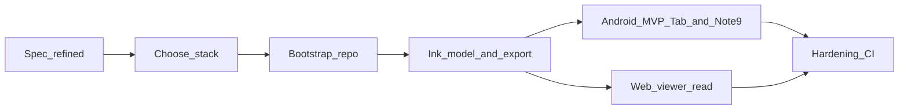

# v-note plan

**Repository:** [vcheesbrough/v-note](https://github.com/vcheesbrough/v-note) · local checkout `/home/vincent/dev/v-note`

**Task queue:** [v-notes Kanban board](https://bored.desync.link/boards/v-notes) on bored — agents pick up cards per [`AGENTS.md`](../AGENTS.md) §1. This plan remains the **product/spec** source of truth; cards track execution.

**Overview:** Greenfield **v-note** (slug `v-note`): **flat ink-only pages**; **MVP: owner-only, ink capture/sync/search**; **native Kotlin Android** (always online); **SPA same freshness as Android**; **LAN or mesh only**, **no split DNS**; **two deployments (dev + prod)** on **mini** via Traefik—**prod `v-notes.desync.link`**, **dev `v-notes-dev.desync.link`** (bored-aligned); **single hardcoded pen**; **English-only HWR**; Authentik on private network.

## Next session

**Paused:** 2026-06-05 · **Branch:** `master` at **`40cb8f3`** (engineering workflows + doc stubs pushed).

**Current state:** Planning locked. **No application code.** No Kanban card **In Progress**. Board has MVP backbone **#145–#151** and post-MVP backlog **#152–#169**.

### Do this first

1. **Start [#145](https://bored.desync.link/boards/v-notes)** — [`AGENTS.md`](../AGENTS.md) §1:
   - `move_card` → **In Progress**
   - `update_card` → `# Iteration 1 — Bootstrap monorepo, CI, and test infrastructure`; **Branch:** `feat/iteration-1-bootstrap` from **`master`**; **Version:** `0.1.0`
2. **Implement #145** — monorepo skeleton, **three runnable artifacts** (server `/health` + **`GET /api/meta`** stub, SPA placeholder, Android `devDebug` launch), **workspace `version` → all artifacts** at CI build, bored-aligned **`.woodpecker/build.yml`** (build + contract-validation + Playwright e2e), **`e2e/`** harness, deploy pipeline **skeleton**, flesh out [`DEV.md`](DEV.md) / [`DEPLOY.md`](DEPLOY.md) run commands. **Reference:** [bored](https://github.com/vcheesbrough/bored) — `.woodpecker/build.yml`, `deploy/docker-compose.yml`, `e2e/`, `authentik/blueprint.yaml`.
3. **Ops check (before first green CI):** confirm **v-note** repo is active in Woodpecker and can push to **`registry.desync.link`** (mirror bored setup).
4. **PR → merge #145** → closes **`bootstrap-repo`** todo; move card **Done**.

### Then (MVP backbone, in order)

| Card | What |
| --- | --- |
| **#146** | Authentik OIDC — SPA + Android auth |
| **#147** | Owner page library |
| **#148** | Android ink capture (WSS, edit lease) |
| **#149** | SPA live ink viewer |
| **#150** | Disconnect / sync error UX (both clients) |
| **#151** | HWR worker + handwriting search → **`1.0.0`** / **`v1.0.0`** |

### Conventions to remember

- **Semver:** pre-MVP **`0.N.P`** until **#151** merges; **`N`** = global iteration (assigned at **In Progress** only) — **not** a fixed seven-card count; insert new MVP cards in TODO + update **Kanban card map** if scope splits.
- **E2e:** every shipped feature needs **CI e2e** before its card merges ([**E2E testing**](#e2e-testing) below).
- **One card, one branch** — no stacking; branch always from **`master`**.

## Project todos

- [x] **supply-spec** — MVP product decisions finalized (page library UX, single pen, HWR queue/provider, disconnect UX, deployments, Authentik, etc.). Major gaps closed; proceed to bootstrap.
- [x] **choose-stack** — Stack locked — see **Stack decisions** table (Rust Axum, PostgreSQL, Leptos/Trunk, Kotlin Compose, PaddleOCR, bored-aligned deploy).
- [ ] **bootstrap-repo** — Initialize **v-note** monorepo (workspace, crates, frontend, android, deploy, schemas, CI). **Card:** [#145](https://bored.desync.link/boards/v-notes). **Status (2026-06-05):** **minimal bootstrap done** — `LICENSE`, [`AGENTS.md`](../AGENTS.md), [`README.md`](../README.md), [`.gitignore`](../.gitignore), **PR review agent** ([`.woodpecker/pr-review.yml`](../.woodpecker/pr-review.yml), [`docs/PR-AGENT.md`](PR-AGENT.md)); **full scaffold + build/e2e CI** tracked on **#145**.
- [ ] **vertical-slice-mvp** — Owner-only ink page on Android; strokes on SPA within freshness bar via shared realtime; handwriting search + jump. **Cards:** [#146](https://bored.desync.link/boards/v-notes)–[#151](https://bored.desync.link/boards/v-notes) (auth through search — see **Kanban card map**). **Closes on #151** merge.

## Kanban card map

**Board:** [v-notes](https://bored.desync.link/boards/v-notes) · **Workflow:** [`AGENTS.md`](../AGENTS.md) §1 · **Updated:** 2026-06-05 (post-MVP backlog **#152–#169**)

Iteration numbers (`N`) and semver are assigned **when a card moves to In Progress** — not shown here. **Pre-MVP** (until **`vertical-slice-mvp`** closes): **`0.N.P`**; **MVP release** (today **#151** merge): **`1.0.0`**; **post-MVP** (after **`1.0.0`** on **`main`**): **`1.N.P`**. **MVP backbone below is the current plan, not a fixed count** — additional iterations may be inserted in TODO before MVP; update this map when cards are added. See **Engineering workflows** → **Versioning**. TODO column order = execution order (**#145** first, then ascending). **Every card:** shipped features require **CI e2e** before merge — see **E2E testing**.

### User story backbone (MVP)

| Exec order | Backbone step | Card | Title (board heading) |
| --- | --- | --- | --- |
| 1 | *(foundation)* | **#145** | Bootstrap monorepo, CI, and test infrastructure |
| 2 | **Sign in** | **#146** | MVP authentication (Authentik OIDC) |
| 3 | **Browse pages** | **#147** | Owner page library |
| 4 | **Capture ink** | **#148** | Android ink capture |
| 5 | **View ink live** | **#149** | SPA live ink viewer |
| 6 | *(sync hardening)* | **#150** | Disconnect and sync error UX |
| 7 | **Find ink** | **#151** | HWR worker and handwriting search |

### MVP behaviours → cards

| Plan behaviour / spec cluster | Card | Notes |
| --- | --- | --- |
| Monorepo scaffold, three runnable artifacts, Woodpecker push CI, e2e health smoke, contract fixtures, deploy pipeline **skeleton** | **#145** | Closes `bootstrap-repo`; worker deferred |
| Authentik blueprint, OIDC (SPA + Android), JWT middleware, token lifetimes, logout, App Links, `assetlinks.json` | **#146** | Identity only — no page/ink data |
| Flat page library, recent-first, hard delete, owner-only page REST | **#147** | No ink yet |
| Single pen (`#006400`, 2px), infinite canvas, WSS + JSON batches, `stroke_batches`, edit lease, gap fill | **#148** | Android capture only; no SPA replay |
| SPA read-only replay, realtime ticket, pan/zoom, cross-device freshness (happy path) | **#149** | Core live-view path; MVP completes on **#151** (disconnect UX + search still outstanding) |
| Sync/error transparency, disconnect banner, failed-commit retry, no stale cache (Android + SPA) | **#150** | Cross-cutting |
| `crates/worker`, PaddleOCR sidecar, `hwr_jobs` queue, 5s debounce, Postgres FTS, search UI + jump | **#151** | Closes `vertical-slice-mvp` |

### Post-MVP backlog (after #151)

Lightweight cards — **spec TBD** when picked up. Suggested order after MVP; reorder on board as needed.

| Suggested order | Card | Title | Plan areas (summary) |
| --- | --- | --- | --- |
| 1 | **#152** | Ops hardening and live deploy smoke | Live deploy smoke, TLS/Authentik suites, CSP, runbooks |
| 2 | **#165** | OpenAPI and REST contract surface | utoipa emit + CI beyond fixture validation |
| 3 | **#154** | Latency instrumentation and freshness CI | p95 probes, automated Android→SPA timing |
| 4 | **#153** | Export and backup bundles | Sovereign export UX, versioned restore |
| 5 | **#155** | Pen tools and eraser | Tool picker, pressure/tilt, eraser UI |
| 6 | **#156** | Page library enhancements | Archive/trash, clone, tags, pin/reorder |
| 7 | **#157** | Document ingestion and underlays | PDF/images, tiles, dual-source search |
| 8 | **#158** | Sharing and collaboration | ACL, invites, multi-editor, presence |
| 9 | **#159** | Android offline mode | Outbox, zero edit loss reconciliation |
| 10 | **#160** | Browser stylus capture spike | Pointer Events evaluation |
| 11 | **#162** | Alternate HWR and search backends | Cloud OCR, Meilisearch/pgvector, brokers |
| 12 | **#163** | Wire protocol and transport evolution | Binary WSS, SSE+POST fallback |
| 13 | **#161** | Public perimeter and split DNS | Internet exposure beyond LAN/mesh |
| 14 | **#164** | iOS client | Universal Links, native iOS (speculative) |
| 15 | **#166** | Back-channel logout and token revocation | OIDC back-channel / instant session kill |
| 16 | **#167** | In-app mesh and VPN helpers | Optional NetBird/VPN UI (speculative) |
| 17 | **#168** | Third staging environment | Optional third env beyond dev+prod |
| 18 | **#169** | Notes app import spike | Samsung Notes / Google Keep migration (stretch) |

### Folded into other cards

| Plan area | Card |
| --- | --- |
| **Provider churn backfill ops** | **#162** Alternate HWR and search backends |

## Decisions made

- **Name (chosen):** **v-note** — display name and working product label. **Repo slug:** `v-note` (likely same as display name). Earlier naming exploration (e.g. sovereign/recall-style candidates) is **superseded** by this user choice; do not treat those as active options unless reopened explicitly.
- **License (bootstrap, chosen — locked intent for now):** **Copyleft** — user does not want commercial parties taking proprietary advantage without sharing improvements. **Default: AGPL-3.0-or-later** — strong copyleft; **network/SaaS use** of a modified version triggers source-sharing, which fits **self-hosted server + SPA + Android client** (the service boundary is where copyleft should bite). **Alternative if only binary distribution matters:** **GPL-3.0-or-later** — weaker for “host as a service” (modified code can run as SaaS without sharing under GPL alone). **Apply at `bootstrap-repo`:** root **`LICENSE`** file, README license badge, Rust workspace/crate **`license`** fields in **`Cargo.toml`**, Android package metadata. **Revisit before public release** if needed — intent locked in plan for now.
- **Location:** **New repository**, not folded into `[bored](/home/vincent/dev/bored)` unless you explicitly want cross-linking later. **Layout (chosen):** **monorepo** — single **`v-note`** git repo for all clients and ops assets (see **Repository layout** under **Stack decisions**). **Checked out at:** **`/home/vincent/dev/v-note`** (remote **`git@github.com:vcheesbrough/v-note.git`**, branch **`master`**, clean working tree).
- **Repository bootstrap status (2026-06-05):** **Minimal bootstrap done** — **`LICENSE`** (AGPL-3.0-or-later), **[`AGENTS.md`](../AGENTS.md)** (Kanban workflow on **[v-notes board](https://bored.desync.link/boards/v-notes)** + plan alignment), **[`README.md`](../README.md)** (links plan + agents + board; planning phase), **[`.gitignore`](../.gitignore)** (Rust/Android/Leptos-oriented, trimmed), **PR review agent** — **[`.woodpecker/pr-review.yml`](../.woodpecker/pr-review.yml)**, **[`.woodpecker/pr-review-prompt.md`](../.woodpecker/pr-review-prompt.md)**, **[`docs/PR-AGENT.md`](PR-AGENT.md)** (Woodpecker secrets + GitHub App setup). **Still missing vs full `bootstrap-repo`:** root **`Cargo.toml`** workspace, **`crates/{server,protocol,worker}`**, **`frontend/`**, **`android/`**, **`deploy/`**, **`authentik/blueprint.yaml`**, **`schemas/`**, **`contracts/fixtures/`**, **e2e**, **`.woodpecker/build.yml`**, formatter/lint config, CI fixture-validation stub — **deferred intentionally** until more planning; **full build/e2e/deploy CI not mandatory yet** (Kotlin CI TBD).
- **Personal context (drives UX and stack):**
  - **Devices:** Samsung **Galaxy Tab S8 Ultra** (tablet + S Pen) and **Samsung Galaxy Note 9** (phone + S Pen)—two Android form factors, different screen sizes and **Android/API generations** (Note 9 is older; compatibility is a constraint, not optional).
  - **Input modality:** **Handwritten note-taking** with a stylus as a first-class path, not a bolt-on—the product should preserve **stroke-level** authoring (latency, palm rejection expectation). **MVP pen:** fixed **dark green** ink (`#006400`) at **2px logical** width—**no pressure or tilt** (see **Stroke tool (MVP, chosen)**); post-MVP may add pressure/tilt curves.
- **Android client (MVP, chosen):** **Native Android app in Kotlin**—the sole **pen capture** client for MVP (Galaxy Tab S8 Ultra + Galaxy Note 9). Use platform APIs directly for **stylus vs touch**, palm rejection, and low-latency ink via **Jetpack Compose `Canvas` / `drawScope`** and **`pointerInput` / `MotionEvent`** (see **Stack decisions**)—stay **native**, not a cross-platform shell. **MVP pen:** **dark green** (`#006400`), **fixed 2px logical width**—**ignore stylus pressure** from S Pen on both devices (no pressure→width mapping, no dead-zone fallback). **Not in scope:** React Native, Flutter, Capacitor, or WebView-wrapped capture for MVP. **Web:** SPA remains **read-only** for MVP—**ink replay, search, and pan/zoom only** (no ink capture/editing); **read-only does not mean offline or stale-cache viewing** (see **SPA disconnect/error UX**). Browser pen capture stays backlog.
- **Android connectivity (MVP, chosen):** The **Android capture client is always-online** for MVP—it **requires live reachability** to the private stack (**LAN or mesh**). **No offline ink capture**, **no durable local outbox**, and **no queue-and-replay** of strokes on device when the server is unreachable. **Mesh/LAN reachability is user-managed outside the app** (see **NetBird / mesh connectivity**)—v-note does **not** start or control NetBird/VPN; it assumes the **build-configured env URL** (**prod:** **`https://v-notes.desync.link`**, **dev:** **`https://v-notes-dev.desync.link`**) is reachable when the user opens the app. If the stack is down, mesh is off, or Wi‑Fi is wrong: **block ink input** and show a **disconnected banner** (see **Android disconnect UX**); **do not silently accumulate** strokes for later sync. If a commit **fails while still connected**: **block input**, **retry in background**, **unblock on success** (see **Failed commit while connected**). **No stale read-only page views** on reconnect or degraded sync—show **loading/error/blocked** until **live server data** is available (see **Stale read-only snapshot**). **Post-MVP backlog:** offline capture, durable outbox, **zero edit loss** across flaky connectivity (see **Offline reconciliation — post-MVP**).
- **Authoring stack (chosen):** Pen authoring flows through the **online native Kotlin Android app** only for MVP. Tablet/phone/desktop **browser inking** is **explicit backlog / maybe-never spikes**.
- **Sync MVP posture (chosen):** **Self-hosted sync** — the server is the **system of record**; Android commits strokes over the **live path** while connected. MVP supports **online multi-device** use (Tab + Note 9 on LAN/mesh) with **near-instant fan-out** to other sessions, but **only one client may ink/edit a given page at a time** (see **Multi-device / concurrent edit**). **Post-MVP:** offline queues, merge under disconnect, broader intermittent-connectivity hardening, and optional multi-editor merge.
- **Multi-device / concurrent edit (MVP, chosen):** **Single active editor** per `page_id` — only one client may **ink/edit** a page at a time. The server enforces an **edit lease** (or equivalent session-scoped lock): acquire on first stroke/commit intent, renew while the holder is active, release on explicit navigation away, session disconnect, or lease TTL expiry. If Tab and Note 9 (or a second Android session) open the same page while another device holds the lease, the second client is **blocked** — **block ink input** and show a **persistent banner** (e.g. another device is editing this page). **Read-only viewers** (SPA) are **not** edit-lock losers: they may still **observe live ink** via realtime replay per **Cross-device freshness** and **SPA disconnect/error UX**. **No** last-writer-wins silent merge, **no** conflict-resolution UI in MVP. **Post-MVP backlog:** concurrent multi-editor merge (ordered ops / CRDT-ish stroke ids), presence, optional shared editing.
- **Cross-device freshness (chosen):** While **Android or the web SPA** has **working reachability** to the sync endpoint and auth is valid, propagation of ink and page mutations must be **near-instant** across **all enrolled clients**—typical LAN/Wi-Fi should feel **immediate**; prioritize **low-latency duplex delivery** over coarse polling on **both** clients. **Worst-case user-perceived latency** (stroke committed on Android → visible on SPA subscribed to the same page—probe points in `supply-spec`) must stay **≤ ~1 second** under degraded but still-connected conditions. **No MVP fallback** to manual refresh or poll-only SPA viewing as the primary path. **Edit lease** limits **who may author** (one Android editor per page); it does **not** slow **read-only** SPA replay or sibling **subscribe** sessions watching the active editor.
- **Offline reconciliation — zero edit loss (post-MVP):** When devices may queue edits **offline or across flaky connectivity**, reconciliation must **never discard a successfully queued edit**—no silent last-writer-wins that drops strokes. **Not required for MVP** because **Android capture is always-online** (no durable outbox) and **single active editor** avoids concurrent merge on the live path. Preserve as a **product principle** for post-MVP offline mode and **multi-editor** sessions; design stroke ids / ordering so a future outbox does not require schema rewrite.
- **Sync & error transparency (chosen):** **Negative space as signal:** when **no** error affordance is shown, the user should assume **sync is nominal** on **Android and SPA**—**connected** to the private stack, **authorized**, and the **live path is healthy**. **Do not** show idle “all clear” clutter; **quiet chrome means healthy online sync**. Conversely, **any** unreachable stack, transport/auth failure, or failed commit must be **explicit** on **both** clients—never inferrable only from “nothing updated”; use **visible technical errors** (HTTP, TLS, DNS, WebSocket close, OIDC revoke, mesh down, correlation id, hostname-level URL). **MVP Android has no offline/pending-outbox UI**—disconnect is **blocked input + banner** (see **Android disconnect UX**); failed commit while connected is **blocked input + background retry + unblock on success** (see **Failed commit while connected**). **MVP SPA** must **realtime-subscribe** for live ink—a static cache is **not** an acceptable substitute for freshness when the live path is up. On disconnect or sync/server errors, SPA applies the **same blocking trilogy** as Android (see **SPA disconnect/error UX**): **banner + blocked UI** until live path healthy—**not** a degraded read-only view of stale cache. **No stale read-only fallback** on either client when live data is unavailable (see **Stale read-only snapshot**).
- **Android disconnect UX (MVP, chosen):** When the Android client **loses connectivity** to the server (stack unreachable, transport down, mesh off, wrong Wi‑Fi), **block all ink input**—no drawing, no editing—and show a **persistent banner** explaining the disconnected state. Applies to **disconnect/offline scenarios** for the **always-online MVP**; do **not** silently accumulate strokes. **No offline read path**—do **not** show cached/stale page content; show **loading/error/blocked** until **live server data** returns (see **Stale read-only snapshot**). **Post-MVP** offline mode replaces this with outbox + replay. **SPA parity:** see **SPA disconnect/error UX**.
- **Failed commit while connected (MVP, chosen):** When a stroke/commit **fails** but the device is **still connected** (or reconnects while the failure persists), **block all ink input**, **retry the commit in the background**, and **unblock only on successful commit**. Align with **Android disconnect UX**—same **block + persistent banner** pattern; banner copy should **distinguish commit-failure/retry** from pure disconnect when useful (e.g. correlation id, retrying state). Do **not** silently accumulate strokes or allow new ink until the pending commit path is healthy again.
- **Stale read-only snapshot (MVP, chosen):** **No** — always require **live server data** in MVP. Do **not** offer cached/stale read-only page views on reconnect or when sync is degraded; show **loading/error/blocked** state until live data is available. Applies to **Android and SPA** equally—no “last known good” ink replay from local cache as a substitute for the live path. **Post-MVP backlog:** optional offline read cache with explicit stale labeling if offline mode ships.
- **Realtime transport (chosen):** **Ship with exactly one concrete wire protocol** for the first implementation (pragmatic: one path to debug, one set of TLS/proxy quirks). **Do not treat that protocol as a permanent product commitment**—the plan assumes you may **switch or add** a different wire format later (different ops constraints, browser limits, mesh topology). **Duplex live sync** is therefore delivered through a **small, stable domain interface** (subscribe per `page_id`, send/receive **ordered delta batches**, reconnect with **cursor/sequence**, backpressure signals, credential refresh hooks), with the v1 protocol isolated in **one adapter module** per platform (server, Android, SPA). **v1 concrete choice:** see **Wire protocol v1 (chosen)** under **Stack decisions** (**WSS + JSON** on Traefik; **SSE+POST** documented as fallback only). **Product contracts** (ink envelope semantics, REST, export bundles) stay **encoding/transport-agnostic** at the domain layer—only the adapter changes when the wire format changes.
- **SPA disconnect/error UX (MVP, chosen):** Web SPA remains **read-only** in MVP (**no ink capture/editing**—replay, search, pan/zoom only). **Read-only means no authoring**, not permission to view **stale cached ink** while disconnected. On **disconnect** or **sync/server errors**, SPA applies the **same blocking pattern as Android**: require **live server data**, show **banner + blocked UI** (loading/error until live path healthy)—**not** a degraded read-only view of stale cache with a disconnected indicator. **Disconnect:** block the viewer (no ink replay/search on stale data) + persistent disconnected banner. **Failed commit / mutation errors while connected** (e.g. subscription/auth/realtime path unhealthy): same **block + banner** pattern; banner distinguishes **retry vs disconnect** when useful. **No stale snapshot:** aligns with **Stale read-only snapshot**—always require live server data on **both** clients.
- **Web experience (chosen for MVP):** SPA authenticates on **LAN/mesh**, renders **vector ink** on the **infinite canvas** with the same pan/zoom physics as Android, and surfaces **handwriting search**. **Freshness:** SPA must meet the **same near-instant / ≤ ~1s worst-case** bar as Android (see **Cross-device freshness**) by **subscribing through the same realtime adapter semantics**—live ink tail, not manual refresh as primary. **Sync/error transparency** applies equally; power-user diagnostics must not be **Android-only**. **Read-only MVP:** **no pen capture/editing**—not offline or stale-cache viewing (see **SPA disconnect/error UX**). **Online-required for live view:** if the private stack is unreachable or sync is degraded, **banner + blocked UI** until live path healthy—**no stale read-only cache** (see **Stale read-only snapshot**, **SPA disconnect/error UX**).
  **Future note:** **Browser-hosted pen capture** stays **explicit backlog** pending Pointer Events fidelity spikes—never prerequisite for ink replay or search. **Document underlays** (PDF/image imports) are **post-MVP** (see **Document ingestion — post-MVP**).
- **Identity (chosen):** **Self-hosted Authentik** is the **identity provider**—treat it as the system of record for **users, groups, SSO, and OAuth/OIDC clients**. The **v-note** API and web SPA authenticate **via Authentik**; **token lifetimes and logout** follow **Authentik token lifetimes** and **Authentik logout / revoke UX** (bored-aligned). JWKS-backed **JWT validation** on the API. **Two Authentik application/provider pairs**—**dev** and **prod**—synced from repo blueprint on deploy (same cadence as bored): separate **`v-note-browser-{dev,prod}`** SPA clients (confidential, server-side code exchange), **`v-note-android-{dev,prod}`** mobile clients (PKCE + **`offline_access`**), **access-only env scopes** **`v-note:dev:access`** / **`v-note:prod:access`** (see **Authentik OIDC scopes/claims (MVP, chosen)**), issuers **`https://auth.desync.link/application/o/v-note-{dev,prod}/`**. **Android redirect (MVP, chosen):** see **Authentik / Android OAuth (MVP, chosen)**—**per-env App Links** on **`v-notes-dev.desync.link`** vs **`v-notes.desync.link`**. **Web SPA** uses **`/auth/callback`** on the matching env hostname.
- **Authentik OIDC scopes/claims (MVP, chosen):** **Access-only** — mirror **[bored](/home/vincent/dev/bored)** [`authentik/blueprint.yaml`](/home/vincent/dev/bored/authentik/blueprint.yaml): env scopes **`v-note:dev:access`** and **`v-note:prod:access`** only (empty `return {}` scope-mapping expressions—grant env access, no custom claims). **No extra OIDC claims** beyond Authentik defaults from standard scopes (**`sub`**, **`email`**, **`profile`** via **`openid profile email`**). **No** v-note-specific custom scope mappings, actor/service identity scopes, or profile claim extensions in MVP (contrast bored’s separate **`bored:mcp:identity`** mapping—**not needed** for v-note MVP). **Client request scopes:** **Android** — **`openid profile email offline_access`** + env access scope; **SPA** — **`openid profile email`** + env access scope (no **`offline_access`**). API **`REQUIRED_SCOPE`** per deployment matches env (**`v-note:dev:access`** vs **`v-note:prod:access`**)—same per-env token isolation pattern as bored **`bored:dev:access`** / **`bored:prod:access`**.
- **Authentik / Android OAuth (MVP, chosen):** **Android App Links** (HTTPS)—**not** a custom URL scheme. **Per-env redirect URIs** (narrow intent filter—only the build’s env path is claimed): **prod** **`https://v-notes.desync.link/auth/mobile/callback`**; **dev** **`https://v-notes-dev.desync.link/auth/mobile/callback`**. SPA browser routes (e.g. **`/auth/callback`**) remain **unaffected**. **No backend OAuth handler required** at the callback path for MVP—the OS delivers the URL with **code + state** to the app; the app exchanges with the matching Authentik provider; an optional **static fallback page** at that path is OK. Host **`/.well-known/assetlinks.json`** on **each env hostname** via **Traefik** for App Link verification (dev and prod may differ by **`package_name`/`sha256`** if using separate Android application ids). **iOS later:** same paths with **Universal Links** + **`apple-app-site-association`**; separate OAuth **client_id** per platform **and env** remains OK.
- **Network perimeter (MVP, chosen):** Clients reach the **entire stack** (v-note API, realtime, SPA; **Authentik** at **`auth.desync.link`**) **only over private paths**—**home/office LAN** or **mesh overlay** (e.g. **NetBird**, connected **outside the app**—see **NetBird / mesh connectivity**). **No public-internet exposure** in MVP. **Android + SPA** require live reachability on LAN or mesh; v-note clients **do not** embed NetBird SDK, auto-start VPN on boot, or expose in-app connect UI. **Two deployments on mini** (**dev** + **prod**)—see **Deployments / CI-dev access**—each with its own Traefik router hostname. **TLS** terminates at **existing Traefik on mini** (see **TLS / termination**); clients use **HTTPS** on the env hostname, not plain HTTP. **Post-MVP:** optional **public-internet** exposure beyond LAN/mesh (perimeter change, not a substitute for Traefik TLS on private paths). **MVP HWR path is self-hosted only** (PaddleOCR on **mini**)—**no frontier/cloud recognition egress** on the initial provider path; optional cloud providers may be added later as **alternate pluggable providers** (see **HWR / OCR provider (MVP, chosen)**).
- **NetBird / mesh connectivity (MVP, chosen):** **No direct interaction with NetBird** in v-note clients. User connects to NetBird (or LAN) **outside the app**—no in-app NetBird SDK, auto-start on boot, or VPN connect UI in MVP. App assumes network path to the **configured env base URL** (**`https://v-notes.desync.link`** prod, **`https://v-notes-dev.desync.link`** dev) is already available; **disconnect UX** handles unreachable server (see **Android disconnect UX**, **SPA disconnect/error UX**). **Post-MVP backlog:** optional in-app mesh/VPN helpers only if product scope reopens—MVP treats connectivity as an OS/user ops concern.
- **Canonical hostname / DNS (MVP, chosen):** **Two fixed hostnames** on **`desync.link`**, both **A → `mini`**, **no split DNS** on either FQDN: **prod** **`v-notes.desync.link`**; **dev** **`v-notes-dev.desync.link`** (bored-aligned **`{service}-dev.desync.link`** pattern). Each env is the **single canonical name** for API, Authentik callbacks, SPA, and Android App Links **for that deployment**. Clients do **not** use location-dependent resolution for the same hostname.
- **DNS (MVP, chosen):** **No split DNS** — do **not** operate split-horizon or location-dependent DNS where the **same hostname** resolves to **different addresses** on home Wi‑Fi vs cellular vs mesh. MVP uses **`v-notes.desync.link`** (prod) and **`v-notes-dev.desync.link`** (dev), each **A → `mini`**, as **two stable names**—not one name with dual resolution. Wi‑Fi ↔ cellular handoff is handled by **mesh connectivity**, not DNS tricks.
- **TLS / termination (MVP, chosen):** Use **existing Traefik termination** on **mini** with the **wildcard cert** already in place. **Both env hostnames** route through Traefik to their v-note stack (API, realtime, SPA; Authentik remains **`auth.desync.link`**). **No** separate Caddy or per-service Let's Encrypt setup for MVP; **no** Cloudflare proxy requirement for MVP; **not** plain-HTTP-only—clients target **`https://…`** on LAN/mesh. Certificate lifecycle follows the **existing mini Traefik/wildcard** ops model, not a greenfield edge stack per service.
- **Visibility (MVP, chosen):** Every **page/canvas** belongs to exactly **one Authentik user (creator/owner)** and is **visible only to that owner**—no sharing, no invites, no collaborator roles in MVP. Enforce **owner-only** auth on **every** REST, asset fetch, **realtime subscription**, and search query (`page.owner_id == authenticated subject`). Realtime fan-out targets only **the owner's enrolled sessions** subscribed to that `page_id`; **edit lease** gates **ink mutation** to one holder while **subscriptions** (including SPA read-only) still receive ordered deltas. **Post-MVP backlog:** per-page ACL, invitation-based collaboration, viewer/editor grants, revocable shares—design APIs so an ACL layer can land later without rewriting ink/sync, but **do not ship ACL behaviour in MVP**.
- **Stroke tool (MVP, chosen):** **One hardcoded pen**—no tool picker, no presets, no highlighter/marker/eraser in MVP. **Dark green** ink at **`#006400`** (hardcoded MVP colour; CSS *darkgreen*) at a **fixed 2px logical width** (constant across Tab S8 Ultra and Note 9)—**no pressure sensitivity in MVP**. Native Kotlin capture **ignores** S Pen / stylus **pressure** data even when hardware reports it; every sample renders at the same width. Wire format may carry a constant `tool_kind` (or omit tool selection entirely), **omit pressure** or record **`pressure: null`** on all samples, and a constant stroke colour **`#006400`** (or equivalent channel encoding)—so **post-MVP** presets and pressure curves can extend the schema without breaking v1 strokes. SPA replay and export rasterisation use the **same dark green (`#006400`) + 2px constant**—no pressure→width mapping on any client. **Post-MVP backlog:** preset library, colour/width UI, pressure/tilt curves, highlighter/eraser.
- **Canvas & navigation (chosen):** Each page is an **infinite 2D drawing surface** addressed in **world/document coordinates** (not screen pixels). The composer is **scrollable and zoomable** using **standard finger gestures**—single-finger **pan/drag** and **pinch-to-zoom** (rotation optional/backlog). **Stylus input keeps drawing** while **touch manipulates the viewport**; implementation must **disambiguate `TOOL_TYPE_STYLUS` vs finger/touch** so ink capture does not fight navigation (with reasonable fallbacks on Note 9-class hardware). Stored ink never mutates when zooming—only the **view transform** changes.
- **Document ingestion (post-MVP, not MVP):** Attaching **PDFs, raster images**, or Office files as **placed underlays** with ink on top is **beyond MVP scope**. MVP pages are **ink-only** on an infinite canvas—no import pipeline, no object-store binaries for documents, no tile compositor for PDFs/images. **Post-MVP backlog:** attach documents (baseline **PDF + raster images**), model **placed underlays** with affine placement in world space, **vector ink layers** above imports, content-addressed storage, export bundles including originals—design page/ink schema so underlays can land later without rewriting stroke sync.
- **Canonical ink (chosen):** **Vector strokes and page geometry are authoritative**—they define what the user actually wrote. **HWR- and provider-derived text** exist only as **derived search/index artifacts** (plus provenance metadata). Normal ops may **rebuild or drop index rows** from canonical ink **without** losing authored strokes.
- **Handwriting search (chosen requirement):** Handwriting stays **globally searchable across every page the owner created**—including **highly illegible English penmanship** (see **Illegible handwriting & search**). **Canonical ink** governs truth; indexed strings are **hints**. Persist **derived text + confidence + stroke/bbox links**, and enforce **owner-only** scope on indexer writes and query results. **Orchestration stays on infrastructure you operate** (**Postgres-backed job queue** via **pluggable queue trait**, workers, indexes, exports); recognition runs **server-side** behind a **pluggable recognition provider contract**—MVP uses **self-hosted PaddleOCR on mini** with **no cloud egress** on the initial path (see **HWR / OCR job queue**).
- **HWR / OCR provider (MVP, chosen):** **Pluggable provider pattern** — recognition backend is **swappable** via **interface/trait + config** (same spirit as transport pluggability). Stable **internal** contract: rasterized ink **region crop** (or render) + metadata in → normalized text + confidence + **`provider_id` / `engine_rev`** out. **Initial provider: PaddleOCR**, **self-hosted on mini** (dev + prod stacks)—process **rasterized ink regions** after **5s idle debounce** (see **HWR indexing cadence**); **English-only**; **async indexing** (see **Recognition & search latency**). **No vendor lock-in at architecture level**—PaddleOCR is the **first implementation**, not the final one; user expects to change mind later (frontier APIs, MyScript, etc.) by swapping or adding **alternate providers** behind the same trait. **Self-hosted aligns with LAN/mesh MVP**—**no frontier egress on the MVP path**; frontier/cloud providers are **future alternate providers**, not MVP requirements. **Vendor API keys never ship in Android or the SPA**—only backend/worker roles call providers; clients enqueue work through **your** authenticated API. Store **`recognition_engine_rev`** (or equivalent) on index segments so re-runs after provider swaps remain **auditable**. Minimize payloads (cropped lines/regions in **world space**, not whole notebooks). **Post-MVP / optional providers:** frontier-class cloud APIs (vision-language, MyScript, etc.) as **config-selected alternate providers**—with explicit retention/DPA/logging and optional **“disable cloud recognition”** hard mode for zero egress.
- **Recognition language scope (MVP, chosen):** **English only** for **handwriting recognition** (HWR / line-level OCR) in v1. **Non-English handwriting** is still **stored and synced**; search may show **weak/absent HWR matches** until later language support. **Printed/embedded document text search** is **post-MVP** (requires doc ingestion).
- **Illegible handwriting & search (chosen):** **Chicken-scratch English** is a **first-class scenario**: search must return **useful leads** (jump to stroke/region) even when recognition is imperfect. Pipeline runs **while Android is online** (MVP capture precondition): **PaddleOCR** (MVP self-hosted provider) on debounced rasterized regions, plus optional **user-triggered re-read** after edits. **Low-confidence / difficult ink:** improve via **alternate pluggable providers** later (e.g. frontier-class cloud APIs)—**not MVP**; no automatic cloud escalation on the initial path.
- **Recognition & Android connectivity (MVP, chosen):** **HWR runs server-side when ink is committed over the live path**—consistent with **Android always-online** capture. No on-device recognition and no indexing of strokes that never reached the server. If capture is blocked due to unreachable stack, **no new search index** for that session—errors must be explicit (see **Sync & error transparency**).
- **Recognition & search latency (MVP, chosen):** No fixed SLA from pen-up to searchable text—indexing catches up **"whenever"** the server/indexer processes work after a successful online commit. **Not** a hard deadline (no 5s/30s bar); **qualitative acceptance only** (search feels useful in normal use, not a timed guarantee). Still **English-only HWR**, **server-side after online commit** (see **Recognition & Android connectivity**).
- **Re-index after erase (MVP, chosen):** Yes — when strokes are **erased or deleted**, queue **HWR re-index** (or **index invalidation + re-run**) so search does **not** retain ghost hits from removed ink.
- **HWR indexing cadence (MVP, chosen):** **Debounce after idle — 5 seconds** — enqueue HWR/re-index work for a region/page only after **no new stroke activity** on that scope for **5s** (coalesce the stylus firehose before recognition units). Complements **"whenever"** post-commit latency (no fixed pen-up→searchable SLA); does **not** imply a 5s search guarantee.
- **HWR / OCR job queue (MVP, chosen):** **Postgres-backed queue** for recognition work — a **`hwr_jobs`** (or equivalent) table with **status**, **attempts**, **scheduling** (`run_after` / priority), and **idempotent job keys** tied to page/region + revision tokens. **Workers** claim rows with **`SELECT … FOR UPDATE SKIP LOCKED`** so multiple worker processes can scale without double-processing. **API/server** enqueues after the **5s idle debounce** (and on **re-index after erase**); workers **retry** with backoff on transient failures; domain semantics (**debounce, retry, re-index on erase**) stay fixed regardless of queue backend. **Pluggable queue provider pattern** — mirror the **HWR recognition provider** approach: a **queue provider trait/interface + config** so the backend can be swapped later (**RabbitMQ**, **NATS**, **Redis** streams, etc.) **without** rewriting ink/search clients or job payload shape; **MVP ships one implementation: Postgres job table**. **Workers call the queue abstraction only** — not raw SQL scattered through recognition code. **Explicitly deferred for MVP:** **Kafka**; **no external broker** on the hot path; **Rabbit/similar only as future alternate queue providers**, not v1 infra. User **explored Kafka and general queue/broker options** for MVP scale and **rejected** them — Postgres job table is sufficient until throughput or ops constraints force a broker.
- **Page library UX (MVP, chosen):** The owner’s **flat page list** (no notebook hierarchy) uses **recent-first** ordering (typically by last edit or open time—freeze field in `supply-spec`). **Delete is hard delete**—removed pages and their ink/search artifacts are purged from the system of record; **no archive, trash, or soft-delete semantics** in MVP. **No page clone** in MVP. **No tags or labels** in MVP. **Post-MVP backlog (speculative):** manual pin/reorder, archive/trash recovery, **page clone perhaps** (optional future—not a committed v1.1 item unless scope reopens), lightweight tagging—design APIs/schema so these can land without rewriting owner-only page CRUD.
- **Authentik token lifetimes (MVP, chosen):** Mirror **[bored](/home/vincent/dev/bored)** — [`authentik/blueprint.yaml`](/home/vincent/dev/bored/authentik/blueprint.yaml) does **not** override provider validity, so Authentik **defaults** apply on shared **`auth.desync.link`**: **access token `hours=1` (1h)**, **refresh token `days=30` (30d)**, **refresh rotation** via Authentik default **`refresh_token_threshold=seconds=0`** (renew refresh token on every refresh). v-note blueprint should **omit overrides** (same as bored) unless ops later tighten globally. **Per client:**
  - **`v-note-android-{dev,prod}`** (native, PKCE): request **`openid profile email offline_access`** + env access scope (`v-note:dev:access` / `v-note:prod:access`)—**access-only env scope**, no custom claims (see **Authentik OIDC scopes/claims (MVP, chosen)**). Persist **refresh token** in **Android Keystore**; use **access token** for REST/realtime; **silent refresh** before expiry and on **401** (realtime reconnect uses same hook). **1h access + 30d refresh** matches bored’s IdP defaults and mobile best practice (short bearer, long re-auth interval).
  - **`v-note-browser-{dev,prod}`** (SPA, bored-aligned **confidential** server-side code exchange): request **`openid profile email`** + env access scope — **no `offline_access`**, **no custom claims** (same scope list as bored [`/auth/login`](/home/vincent/dev/bored/backend/src/routes/auth.rs)). Store **access token only** in **httpOnly `Secure` `SameSite=Lax` cookie**; **ignore refresh_token** from token response. Session cookie **max-age 24h**; **JWT `exp` is authoritative** (middleware rejects expired tokens). User re-authenticates when access expires (~1h) via redirect to login — acceptable for read-only SPA on private LAN/mesh.
  - **Dev and prod** use the **same numeric lifetimes** (separate providers; not shorter dev tokens).
- **Authentik logout / revoke UX (MVP, chosen, bored-aligned):** **SPA:** `GET /auth/logout` clears session cookie, then redirects to env **`OIDC_END_SESSION_URL`** — **`https://auth.desync.link/application/o/v-note-{dev,prod}/end-session/`** (see bored deploy env in [`.woodpecker/build.yml`](/home/vincent/dev/bored/.woodpecker/build.yml)). Navbar **sign out** is top-level navigation to that route. **Android:** **Sign out** wipes **Keystore** tokens locally; optionally open **Chrome Custom Tab** (or system browser) to the same **end-session** URL so Authentik SSO session ends (parity with SPA). **No** separate token-revocation API in MVP — rely on **local wipe + RP-initiated logout**; forced re-login after admin revocation is handled by **failed refresh** → login flow. **Post-MVP:** back-channel logout / refresh revocation if ops require instant kill.
- **Deployments / CI-dev access (MVP, chosen):** **Two environments—dev and prod**—mirroring **[bored](/home/vincent/dev/bored)** on the same **mini** host. **Woodpecker** CI: push builds + e2e on every commit; **manual deployment** (`CI_PIPELINE_DEPLOY_TARGET=dev|prod`) pushes images to **`registry.desync.link`**, applies **Authentik blueprint** before roll-out, and runs **`docker compose`** against the host docker socket (no SSH/jump box). **Prod** deploys only from **`main`**; **dev** may deploy from feature branches. **Separate hostnames, containers, DB volumes, OIDC clients, and scopes per env** (see table below). **CI/dev access:** developers and CI hit **dev** at **`https://v-notes-dev.desync.link`** over the same **NetBird/LAN path outside the app** as prod—no always-on mesh requirement beyond normal ops, **no jump box**. Android dev builds and local agents target **dev**; Tab/Note 9 **prod** builds target **`v-notes.desync.link`**.

| Env | URL | Container (example) | DB volume (example) | OIDC scope (example) |
| --- | --- | --- | --- | --- |
| **dev** | `https://v-notes-dev.desync.link` | `v-note-dev` | `v-note-dev-db` | `v-note:dev:access` |
| **prod** | `https://v-notes.desync.link` | `v-note` | `v-note-prod-db` | `v-note:prod:access` |

**Shared infra (both envs):** **Traefik on mini** (`proxy-backend`, `certresolver=myresolver`), **Authentik** at **`https://auth.desync.link`**, image registry **`registry.desync.link`**. Dev images tagged **`MAJOR.MINOR.PATCH-<sha>`** (pre-MVP: **`0.N.P-<sha>`**); prod **`MAJOR.MINOR.PATCH`** + git release tag on prod deploy — first prod MVP tag **`v1.0.0`** at **#151** (see **Versioning**). **Post-MVP:** no third “staging” env unless ops explicitly add one (**#168**).

## Stack decisions

All **`choose-stack`** items are **locked** (user choices + agent defaults below). Full matrix:

| Component | Choice | Notes |
| --- | --- | --- |
| **Repository** | **Monorepo** (`v-note`) | Server, SPA, Android, `deploy/`, Authentik blueprint, e2e, CI, `schemas/`, `contracts/fixtures/`, `crates/protocol` — not multi-repo |
| **License (bootstrap)** | **AGPL-3.0-or-later** | Copyleft intent locked for bootstrap — **`LICENSE`**, README badge, **`Cargo.toml`** / Android metadata at repo init; **GPL-3.0-or-later** noted as weaker alternative if SaaS trigger is not wanted; revisit before public release |
| **Server language** | **Rust** | Aligns with bored backend patterns; shared tooling (rustfmt, clippy, workspace) |
| **Server framework** | **Axum** | REST + middleware; **WSS** via **axum/tungstenite** (or equivalent) on same Traefik host as HTTPS |
| **Server persistence** | **PostgreSQL** | System of record: pages, strokes, edit leases, revisions; **separate dev/prod DB volumes** on mini (bored-aligned naming, e.g. `v-note-dev-db` / `v-note-prod-db`) |
| **HWR job queue (MVP)** | **Postgres job table** + **pluggable queue trait** | **`hwr_jobs`** table: status, attempts, scheduling; workers claim via **`FOR UPDATE SKIP LOCKED`**; API enqueues after **5s debounce** / erase re-index; **Postgres is first queue provider**; workers use **queue abstraction only**. **Deferred:** Kafka, external broker in MVP; **RabbitMQ/NATS/Redis** as **future alternate queue providers** behind same trait (user explored broker tech at MVP scale—rejected for v1) |
| **Search (MVP)** | **PostgreSQL FTS** | Owner-scoped full-text on derived HWR/index rows; **Meilisearch / pgvector deferred** |
| **SPA** | **Leptos** + **Trunk** | WASM SPA; **Canvas2D** via **web-sys** for read-only ink replay (no shared render lib with Android) |
| **SPA ↔ contracts** | **`crates/protocol`** | Leptos frontend imports same **serde** types as server; fixtures + JSON Schema keep Android aligned |
| **Android UI** | **Jetpack Compose** + **`Canvas` / `drawScope`** | Infinite ink compositor; stylus via **`pointerInput` / `MotionEvent`**; MVP ignores pressure (simpler path) — **not** Views/XML |
| **Android networking** | **OkHttp** | **WebSocket** for WSS + REST/OAuth (PKCE, refresh) — matches common Kotlin stack |
| **Android build** | **`dev` / `prod` product flavors** | Base URL (`v-notes-dev` vs `v-notes`), Authentik client, App Link host per env |
| **Android exclusions** | **No RN / Flutter / Views-XML capture** | Native Kotlin only for pen capture (already rejected cross-platform shells) |
| **Server exclusions** | **Not .NET** | SignalR / ASP.NET out of scope |
| **Wire protocol v1** | **WSS + JSON** | Coalesced stroke batches; `last_acked_seq` gap-fill or snapshot+tail; binary deferred; SSE+POST fallback-only |
| **Contracts** | **`schemas/`** + **`contracts/fixtures/`** + **`crates/protocol`** | JSON Schema (WSS, strokes, REST); CI validates fixtures on server + Android + SPA; **utoipa** OpenAPI; Pact deferred |
| **HWR v1 provider** | **PaddleOCR** (self-hosted) | **Separate compose service** on mini (sidecar); **dev/prod image tags**; pluggable **provider trait**; internal network from API/worker |
| **HWR worker** | **Rust worker** (queue + provider abstractions) | Claims jobs via **queue provider trait** (Postgres impl); **rasterizes** world-space ink regions; calls **recognition provider trait** (PaddleOCR v1); 5s idle debounce enqueue; English-only; retry + **re-index on erase** |
| **E2E testing** | **Full feature coverage in CI** | Every shipped user-facing feature has automated e2e tests before its card merges — see **E2E testing (chosen)**; bored-aligned compose + Playwright + Android instrumented tests; contract/unit tests supplement, never substitute |
| **Versioning** | **`0.N.P` pre-MVP → `1.0.0` → `1.N.P`** | Pre-MVP until **`vertical-slice-mvp`** closes: `0.N.P`; MVP completion merge (today **#151**): `1.0.0` + `v1.0.0`; post-MVP: `1.N.P` with **global `N` continuing** — count not fixed — **Engineering workflows** |
| **Client–server sync** | **`release` + `protocol`** | Pre-MVP: **exact `release`**; MVP+ (`1.x.x`): **same `major.minor`**, patch may drift; **`protocol`** always exact — **Engineering workflows** → **Client–server version alignment** |
| **Deploy / CI** | **Bored-aligned** | Woodpecker push build + e2e; manual `dev\|prod` deploy to mini docker socket; `deploy/docker-compose.yml`; Authentik blueprint before roll-out; `registry.desync.link` images |
| **Edge / TLS** | **Traefik on mini** | Wildcard cert; `v-notes.desync.link` / `v-notes-dev.desync.link`; no per-service Caddy for MVP |
| **Identity** | **Authentik** | `v-note-browser-{dev,prod}`, `v-note-android-{dev,prod}`; scopes `v-note:dev:access` / `v-note:prod:access` |
| **Explicit non-goals** | **No shared canvas library; no alt DB/broker for MVP** | Two canvas implementations (Compose + Canvas2D), one protocol spec; **not** Surreal embedded, SQLite, or Mongo/document DB for MVP ink/search; **not Kafka or external message broker** on MVP path (Postgres queue sufficient at chosen scale) |

**Android UI rationale (agent):** **Jetpack Compose** is the modern default for greenfield Kotlin—declarative UI, first-class **`Canvas`/`drawScope`** for custom ink, and **`pointerInput`** for stylus vs touch without legacy View/XML boilerplate; MVP omits pressure, which keeps the compositor path straightforward on Tab S8 Ultra and Note 9.

**Database & ink persistence (confirmed after exploration):** User explored **SurrealDB (embedded)**, **SQLite**, and **document/NoSQL** options (including whether JSON-shaped ink batches justify a document DB). **PostgreSQL reaffirmed for MVP.** Separate **compose Postgres service per env** with bored-aligned volumes **`v-note-dev-db`** / **`v-note-prod-db`**. **Canonical ink** lands in append-only **`stroke_batches`** rows with **JSONB** payloads mirroring **coalesced wire batches**—**not** normalized `(x, y, t)` point tables; optional **page checkpoints** (compact snapshots) may arrive later for gap-fill/replay, not v1 schema requirement. **Search** uses **PostgreSQL FTS** on **derived HWR/OCR text** (owner-scoped index rows)—**Meilisearch, pgvector, and standalone vector DBs stay deferred**. **HWR orchestration (queue, chosen):** **Postgres-backed job table** (`hwr_jobs`: status, attempts, scheduling) with workers claiming via **`FOR UPDATE SKIP LOCKED`**; **pluggable queue provider trait** + config (Postgres first; **RabbitMQ/NATS/Redis** as future alternates); workers and API use the **queue abstraction** so domain job semantics (**5s debounce enqueue**, **retry**, **re-index on erase**) survive a backend swap. User also **explored Kafka and broker-style queues** at MVP scale and **rejected** them for v1—**no Kafka, no external broker** on the MVP hot path. **Explicitly not chosen for MVP:** Surreal embedded, SQLite, Mongo/document DB—the JSONB batch document shape is **storage convenience inside Postgres**, not grounds to pick NoSQL.

- **Repository layout (chosen):** **Monorepo** — **one `v-note` git repository** holds **server** (Rust/Axum), **SPA** (Leptos/Trunk), **native Android** (Compose), **`deploy/`** (compose, Traefik labels, Woodpecker hooks), **Authentik blueprint**, **e2e**, **CI**, and **shared API/contracts**. **Not** multi-repo.
- **Versioning (chosen):** **Pre-MVP** (until **`vertical-slice-mvp`** closes): semver **`0.N.P`** (`N` = global iteration when work starts — **not** tied to a fixed card count). **MVP completion merge** (today **#151**) → **`1.0.0`** (git tag **`v1.0.0`**). **Post-MVP:** **`1.N.P`** with **`N` continuing** from pre-MVP. Additional MVP iterations may be discovered and inserted before release — see **Engineering workflows** → **Versioning**.
- **Client–server version alignment (chosen):** **`release`** + **`protocol`** propagated at build from workspace **`version`**; **`GET /api/meta`**; client headers. **Pre-MVP (`0.N.P`):** **strict** exact **`release`**. **MVP+ (`1.N.P`):** **relaxed** — same **`major.minor`**, patch may drift; **`protocol`** always exact. **Ops default:** lockstep deploy (image + APK same tag) in both phases — see **Engineering workflows** → **Client–server version alignment**.
- **E2E testing (chosen):** **Every shipped user-facing feature is covered by automated e2e tests** before its iteration card merges. **Contract/fixture validation and unit tests supplement e2e; they do not replace it.** See **E2E testing** section for harness layout and per-surface rules. **No manual-only acceptance** for product behaviour; **no “runbook instead of CI”** escape hatches.
- **Client alignment & contract testing (chosen):** **Schema-first** layout — **`schemas/`** holds **JSON Schema** for **WSS envelopes**, **stroke batches**, and **REST DTOs**; **`contracts/fixtures/`** holds **golden JSON** examples consumed by every client. **`crates/protocol`** in the **Rust workspace** defines **serde types** aligned to those schemas; **Leptos SPA imports the same crate**; **Android** stays aligned via **codegen** and/or **fixture unit tests** against the same schemas (no drift-by-hand DTOs). **CI (every PR):** all fixtures **validate** on **server + Android + SPA** **in addition to** e2e coverage per feature. **REST:** **OpenAPI** emitted from the server (**utoipa**) plus **contract validation** against fixtures/schemas. **WSS:** **JSON Schema** + server integration tests with scripted connect/replay sequences (**part of** e2e for realtime paths); **Pact** deferred unless consumer-driven contracts become necessary later. **Replay sanity (separate from wire contracts):** one golden **page fixture** for **bbox/point-count** checks (and optional **render sanity**)—not part of the wire-contract suite. **Explicit non-goal:** **no shared cross-platform UI/render library** — **two canvas implementations** (Compose + Canvas2D), **one protocol spec**.
- **Server stack (chosen):** **Rust + Axum** — API, owner auth, edit leases, page CRUD, **`stroke_batches`** append, **HWR job enqueue** (via **queue provider trait**; Postgres table impl), search API; **PostgreSQL** (separate compose service per env, **`v-note-dev-db`** / **`v-note-prod-db`** volumes) via sqlx (or equivalent) with migrations; **JSONB** coalesced batch payloads (not normalized point rows); **`hwr_jobs`** + **`SKIP LOCKED`** workers; realtime on **WSS** (tungstenite/axum integration). **Not .NET** — SignalR / ASP.NET out of scope. **Not Surreal/SQLite/Mongo/Kafka/external broker for MVP** — confirmed after DB + queue exploration (see **Database & ink persistence**, **HWR / OCR job queue**).
- **SPA stack (chosen):** **Leptos + Trunk** — read-only infinite canvas replay, search UI, pan/zoom; **Canvas2D** (web-sys); imports **`crates/protocol`** for wire types.
- **Android stack (chosen):** **Jetpack Compose** ink layer; **OkHttp** for REST + **WebSocket**; **`dev`/`prod` flavors** for hostname, OIDC client, App Links. **Not** Views/XML, **not** RN/Flutter.
- **Search & index store (chosen):** **PostgreSQL FTS** for MVP owner-scoped handwriting search on **derived HWR/OCR text**; index rows keyed by `(owner_id, page_id, chunk_id)` with stroke/bbox provenance. **Meilisearch**, **pgvector**, and **standalone vector DB** tiers deferred.
- **HWR ops (chosen):** **PaddleOCR** as **separate docker-compose service** (sidecar on mini, dev/prod tags); **pluggable recognition provider trait** in Rust; **pluggable queue provider trait** (Postgres job table v1); **dedicated worker** claims via queue abstraction, rasterizes in worker, calls recognition provider on **internal compose network** only (no frontier egress in MVP). **No Kafka / external broker** in MVP.
- **Deploy (chosen):** Mirror **[bored](/home/vincent/dev/bored)** — Woodpecker `.woodpecker/build.yml`, `deploy/docker-compose.yml`, `authentik/blueprint.yaml` naming adapted to **v-note**; manual deploy targets; OpenBao-backed secrets; separate containers/volumes per env.
- **Wire protocol v1 (chosen):**
  - **Transport:** **WSS (WebSocket Secure)** — **one duplex connection per session**, upgraded on the **same Traefik host** as HTTPS (`wss://v-notes.desync.link/…` prod, `wss://v-notes-dev.desync.link/…` dev). Traefik handles TLS termination and WebSocket upgrade on the existing wildcard cert + `proxy-backend` routers.
  - **Framing:** **JSON** envelopes; **coalesced stroke batches** for ink deltas/commits (position + timestamp in world space per **Coalesce the stylus firehose**). Domain interface remains **encoding-agnostic**—adapter maps batches to/from JSON; **binary/packed encoding deferred** as an optional future adapter without changing **edit lease**, **ordering**, or **search** semantics.
  - **Auth on the live path:** **Bearer access token** on WebSocket upgrade where practical (**Android**). **SPA:** **httpOnly session cookie** may not attach cleanly to WS—mint a **short-lived realtime ticket** via REST after cookie auth (bored-aligned session model otherwise); ticket is **narrow-scoped** (owner + session, short TTL) and consumed on upgrade.
  - **Reconnect / gap recovery:** Client tracks **`last_acked_seq`** (monotonic per-page sequence). On reconnect: **gap fill** from `last_acked_seq + 1` when the server still holds the tail; if gap is too large or session state is stale, **snapshot + tail** (full page stroke snapshot or compact checkpoint, then live tail). Aligns with **Reconnection + gaps** hook below—no durable Android outbox in MVP.
  - **Fallback (not v1):** **Tier B — SSE + POST** (server-push subscribe via SSE, client commits via POST) is **documented only** as a **degraded/fallback** path for environments where WSS is blocked or painful—**not shipped as the MVP hot path**. v1 implements **WSS end-to-end** on server, Android, and SPA.

## E2E testing

**Policy (chosen):** Every **user-facing feature** shipped in an iteration card has **automated e2e coverage in CI** before that card merges. A feature is not done without its e2e spec(s) green in Woodpecker.

**What counts as e2e:** Exercises the **running stack** (or client against the running stack) through **public behaviour** — UI, API, WSS — not internal units in isolation. Contract/fixture validation, `cargo test`, and JVM unit tests **support** e2e but **do not satisfy** this bar alone.

### Harness (bored-aligned; lands in **#145**)

| Piece | Role |
| --- | --- |
| **`e2e/docker-compose.test.yml`** | Mock OIDC + Postgres + server + SPA (+ worker/PaddleOCR when needed); `TEST_IMAGE` from fresh CI build |
| **`e2e/` Playwright** | SPA flows, REST probes, multi-context realtime (two browsers on same page), failure injection (stop service, 5xx) |
| **`e2e/global-setup.ts`** | Wait for `/health`, seed auth cookie/bearer (bored pattern) |
| **`.woodpecker/build.yml` `e2e` step** | `docker compose … up --exit-code-from playwright` (+ Android job when instrumented tests exist) |
| **`android/…/androidTest`** | **Compose UI / instrumented e2e** for native flows Playwright cannot drive (ink capture, lease banner, disconnect UX, search jump) — runs on **emulator in CI** |

Reference implementation: **[bored `e2e/`](https://github.com/vcheesbrough/bored/tree/main/e2e)** (mock-oauth2-server, Playwright, `sse.spec.ts` two-context pattern).

### Per-surface rules

| Surface | E2e vehicle | Examples |
| --- | --- | --- |
| **SPA** | Playwright | Login shell, page library, ink replay, search UI, disconnect banners |
| **REST / auth** | Playwright `request` + rejection contexts | `/api/me`, owner-only pages, 401/403 |
| **WSS / realtime** | Playwright (two contexts) **and/or** scripted client in `e2e/` or server integration tests wired into the **same compose gate** | Commit stroke → sibling session sees delta; gap fill on reconnect |
| **Android native** | **`connectedAndroidTest`** on emulator (CI) | Draw/commit ink, lease block, token refresh, offline banners — use **test doubles** for stylus input where hardware is unavailable |
| **Worker / HWR** | Compose stack with **mock recognition provider** + e2e asserting search UI/API after debounce | Real PaddleOCR optional in dev; CI uses mock |

### Per-card obligation (MVP backbone)

Each **MVP backbone** iteration card (currently **#145–#151**; list may grow) adds or extends e2e specs for **every behaviour in that card's acceptance criteria**. Post-MVP cards follow the same rule when picked up.

| Card | E2e must cover |
| --- | --- |
| **#145** | Health smoke, SPA load, harness extensibility (folders + CI job wired) |
| **#146** | Full auth happy path + 401/403 rejection (SPA + API) |
| **#147** | Page CRUD on SPA; owner isolation; Android page library smoke |
| **#148** | Android ink commit + persist; edit-lease block; WSS gap fill |
| **#149** | Cross-client live ink (Android or WSS helper → SPA tail); non-owner subscribe denied |
| **#150** | Server stop / failed commit → banners + blocked UI on **both** clients |
| **#151** | Search find + jump after mock HWR; re-index after erase; owner isolation |

**Flaky tests:** Fix or quarantine with a tracked issue — **not** dropped in favour of manual QA.

**Live deploy smoke (#152):** Complements PR e2e (real Authentik/TLS on mini); does not replace per-feature PR e2e.

## Engineering workflows

Locked engineering/ops conventions — product behaviour stays in **Decisions made** and Kanban cards; this section is **how we build, verify, ship, and run**.

### Versioning (chosen)

| Phase | Trigger | Workspace semver | Git tag (prod deploy) |
| --- | --- | --- | --- |
| **Pre-MVP** | Any iteration before **`vertical-slice-mvp`** closes | **`0.N.P`** | Dev images only (`0.N.P-<sha>`); no prod MVP tag yet |
| **MVP release** | MVP completion card merged (today **#151**) | **`1.0.0`** on **`main`** | **`v1.0.0`** — closes `vertical-slice-mvp` |
| **Post-MVP** | Iterations after **`1.0.0`** on **`main`** | **`1.N.P`** | Prod **`v1.N.P`** (or patch) per bored `compute-version` |

- **Iteration `N`** (board/branch) is **global and sequential** — assigned when work starts; **not** assumed to equal card count or a fixed pre-MVP total.
- **MVP backbone is open-ended:** cards **#145–#151** are the **current** walking-skeleton slice; insert new TODO cards (and update this plan) when scope splits or new work is discovered — semver **`N`** simply increments.
- **Patch `P`:** bump only on the active **`feat/iteration-N-…`** branch; start each iteration at **`P=0`**.
- **CHANGELOG:** optional per-iteration notes in PR description; formal **`CHANGELOG.md`** deferred until post-**#151** if needed.

### Client–server version alignment (chosen)

**Problem:** Workspace semver governs **builds and deploys**, but **Android is sideloaded** and can outlive a server upgrade. **Schema/fixture CI** keeps wire **shapes** aligned in the monorepo — it does **not** tell a running Tab S8 app that the server moved on without a matching APK.

**Two version axes** (do not conflate):

| Axis | Type | Meaning |
| --- | --- | --- |
| **`release`** | Semver (`0.N.P` / `1.N.P`) | Product + deploy version — from root workspace **`version`** |
| **`protocol`** | Integer (`1` for MVP WSS+JSON) | **Breaking** REST/WSS contract — bump only when **`schemas/`** change incompatibly |

**Single source of truth:** root **`Cargo.toml`** workspace **`version`** → propagated at **CI build** to server, SPA (compile-time embed), and Android **`versionName`** (generated file or Gradle task — **not** hand-edited). Same Woodpecker **`build`** step that tags **`registry.desync.link/v-note:{release}`** must produce the **matching Android APK** artifact for that **`release`**.

**Server surface:** **`GET /api/meta`** (lands **#145** stub, full behavior **#146+**):

```json
{
  "release": "0.3.0",
  "protocol": 1
}
```

**Client headers (all phases):** every REST call and WSS connect sends **`X-V-Note-Client-Release`** and **`X-V-Note-Client-Protocol`** (Android + SPA). **`protocol` mismatch** → server **rejects** (HTTP **409** or WSS close with reason); client shows **incompatible-version banner** (distinct from disconnect/retry UX).

**Enforcement by phase:**

| Phase | Server `release` | Rule |
| --- | --- | --- |
| **Pre-MVP** | **`0.N.P`** | **Strict lockstep** — client **`release`** must **exactly** equal server **`release`** (no patch or minor drift). |
| **MVP+** | **`1.N.P`** (from **`1.0.0`** on **`main`**) | **Relaxed lockstep** — client **`major.minor`** must match server **`major.minor`**; **patch may drift** either way within that line (e.g. server **`1.2.3`** accepts client **`1.2.0`**). Cross-minor → **reject**. |

**`GET /api/meta` from `1.0.0` onward** may add **`min_client_release`** (floor patch for the current minor line, e.g. **`1.2.0`**) — implement when **#151** closes or first post-MVP iteration touches version checks.

**Operator norm (both phases):** deploy server image **and** install the **APK from the same CI build / git tag** — **lockstep is the default** even when MVP+ runtime allows patch slack. Document in [`DEPLOY.md`](DEPLOY.md) and **#152** runbook. **Rollback:** redeploy **previous image tag** **and** previous APK together.

**CI / tests:** **#145** — version propagation + **`/api/meta`** stub (pre-MVP strict checks); **#146** — client headers + mismatch e2e; **#151** or follow-on — add e2e for MVP+ same-minor / cross-minor rules when server is **`1.x.x`**.

**Post-MVP UX:** optional in-app “update available” when server patch **`release`** > client (still sideload — link to operator doc, not Play Store).

### CI — push pipeline (lands **#145**)

Woodpecker [`.woodpecker/build.yml`](../.woodpecker/build.yml) on every **push** to **`main`** and feature branches (bored-aligned). Gates:

| Step | What runs |
| --- | --- |
| **build** | Docker image with **rustfmt**, **clippy**, **`cargo test`**; **Trunk** SPA build; **Gradle** `assembleDevDebug`; tag `registry.desync.link/v-note:$CI_COMMIT_SHA` |
| **contract-validation** | Golden fixtures vs **`schemas/`** on server, SPA, Android |
| **e2e** | `e2e/docker-compose.test.yml` — Playwright (+ Android emulator job when instrumented tests exist) |

**PRs:** [`.woodpecker/pr-review.yml`](../.woodpecker/pr-review.yml) Claude agent (already bootstrapped). **Agents:** poll GitHub commit status after push — [`AGENTS.md`](../AGENTS.md) §3.

### Local development

See **[`docs/DEV.md`](DEV.md)** — prerequisites, **`just`** / Makefile targets, compose vs native run paths, local e2e reproduction.

### Database migrations

- Migrations in **`crates/server/migrations/`** (sqlx).
- **Forward-only** in dev and prod — no `reset` on mini DB volumes.
- Destructive DDL requires explicit review in PR.
- Local/dev: `sqlx migrate run` via compose or `just migrate`.

### Deploy & release

See **[`docs/DEPLOY.md`](DEPLOY.md)** — Woodpecker manual deploy (`CI_PIPELINE_DEPLOY_TARGET=dev|prod`), OpenBao secrets, Authentik blueprint apply, compose roll-out. **Prod** only from **`main`**. **Rollback:** redeploy previous image tag (document in **#152**).

### Android distribution (MVP)

- **Sideload** to Tab S8 Ultra / Note 9 — no Play Store in MVP.
- **`dev`** flavor → **`v-notes-dev.desync.link`**; **`prod`** flavor → **`v-notes.desync.link`**.
- **Release keystore** lives outside repo (OpenBao / operator machine); **debug** keystore for dev/CI only.
- CI builds **`devDebug`**; **`prodRelease`** signing wired before prod device rollout (**#152** or first prod deploy).

### Observability (MVP baseline)

- **Structured logging** (JSON or key=value) on server + worker; **correlation id** on failed commits / sync errors (optional in UI).
- **`GET /health`** — process up; **`GET /ready`** (or health subcheck) — Postgres reachable when wired.
- **Metrics/tracing** (Prometheus, Grafana, Loki on mini) — **#152** ops hardening; not required for walking skeleton.

### Dependency & security hygiene

- **Rust:** `cargo audit` (or `cargo deny`) in CI when **#145** lands — warn-only acceptable initially.
- **Android:** Gradle dependency check baseline in CI.
- **Images:** pin by digest in compose where practical (PR review agent flags drift).
- **`SECURITY.md`:** deferred until public release.

## Near-real-time sync — architectural hooks

These constrain **behaviour and domain shape**; **v1 wire protocol is decided** (**WSS + JSON**—see **Wire protocol v1 (chosen)**). The **domain interface** stays adapter-pluggable so a future binary or alternate transport swap is bounded. **Android capture** and **SPA viewing** both assume the **live path is available** for fresh ink; meet the **near-instant** bar in **Cross-device freshness** and the **≤ ~1s worst-case perceived** ceiling on **both** clients while connected.

1. **Push-over-poll primary path (v1: WSS)** — The **live path** is **duplex** over **WSS**: each session **receives server-pushed ordered JSON delta batches** without relying on **coarse polling** as the primary ink delivery mechanism. The server **fans out ordered deltas** to the **owner's sibling sessions** subscribed to the same **`page_id`** only **after verifying owner identity**. **Envelope semantics** (ordering, ack/`last_acked_seq`, subscription scope, edit-lease control messages) are shared across clients; **Tier B SSE+POST** may exist later as fallback only—not v1. Timed JSON **polling** may exist only as **degraded mode** or admin/notifications—not as the sole hot path for live ink.
2. **Coalesce the stylus firehose — single pen** — Batched samples record **position + timestamp** in **world space** on the infinite canvas (zooming/panning never rewrites historical geometry). **MVP:** **dark green** (`#006400`), **fixed 2px logical width**—**no per-sample pressure**; omit `pressure` or set **`pressure: null`** on all samples; **do not read** stylus pressure from `MotionEvent` for width. Android Canvas, export rasteriser, and SPA replay all render **constant-width dark green (`#006400`)** strokes. **Post-MVP:** optional pressure/tilt envelopes and curves.
3. **Reconnection + gaps (v1: `last_acked_seq`)** — Every session tracks **monotonic sequence** per page and **`last_acked_seq`** for committed batches. **Transient** disconnects **replay from `last_acked_seq + 1`** (gap fill) once WSS returns; if the gap is unrecoverable, **snapshot + tail**. **MVP Android:** if reconnect fails persistently, **block input** and show the **disconnected banner**—do not spill to a durable offline outbox; **no stale read-only page views** while waiting (see **Stale read-only snapshot**). **Failed commit while connected:** **block input**, **retry in background**, **unblock on success**—banner distinguishes retry vs disconnect when useful (see **Failed commit while connected**). **MVP SPA:** **same sync-error trilogy** (see **SPA disconnect/error UX**)—**banner + blocked UI** until live server data; **no** degraded stale-cache read path.
4. **Edit lease — single active editor (MVP)** — Per `page_id`, the server maintains an **owner-scoped edit lease** (holder `session_id` + device hint, monotonic lease generation, TTL + heartbeat renew). **Android capture** must **acquire or renew** the lease before accepting ink; commits from non-holders are **rejected**. A second Android session (Tab vs Note 9, or duplicate login) sees **blocked input + banner** (another device is editing)—same blocking idiom as disconnect UX, distinct copy. **SPA** subscribes **read-only** on the realtime channel and is **not** denied by the lease for **replay/search/pan-zoom**; only **ink mutation** paths check the lease. Realtime fan-out still delivers ordered deltas to **all owner subscriptions** on that page. **No** LWW merge or conflict UI in MVP. **Post-MVP:** concurrent multi-editor merge with **offline outboxes** and **zero edit loss** when Android supports disconnected capture.
5. **Web viewer piggybacks canonical replay** — The browser consumes **the same wire-level stroke batches** (validated via **`contracts/fixtures/`** and **`crates/protocol`**) and renders **dark green (`#006400`) constant-width (2px logical)** ink in a **separate canvas implementation**—not a shared cross-platform render library (see **Client alignment & contract testing**). **SPA navigation mirrors the composer:** **infinite canvas** metaphysics + **finger pan/pinch-zoom** behaviours (fallback scrollbars/trackpads acceptable on desktop-only scenarios) remain aligned with Kotlin so cross-device previews do not drift (performance budgeting + optional GPU tiling later).
6. **Kinetic viewport + performance guardrails** — Infinite canvases imply **spatial acceleration** sooner than bounded pages—plan for **dirty-region rendering**, optional **LOD/culling**, and compositing thresholds as stroke counts balloon on Tab/Note 9 hardware. Decide **minimum/maximum zoom clamps**, inertia/easing curves, whether helpers like **double-tap-to-zoom** belong in MVP vs backlog during `supply-spec`.
7. **Optional future browser authoring lane** — *If/when investigated*, route strokes through the **same mutations + ordering + owner auth checks** Android uses today. Transport stays agnostic around stroke envelopes; skipping shipped web authoring must never undermine MVP timelines.

**MVP:** no anonymous readers, no public pages, no cross-user access. **Post-MVP:** invitation-mediated sharing when ACL ships.

## Handwriting recognition & searchable index

1. **Asynchronous ingestion** — After stroke batches stabilize (**5s idle debounce** per region/page—see **HWR indexing cadence**), the API **enqueues recognition jobs** (via **queue provider trait**) spanning logical lines/regions in **world coordinates**. Workers **claim** jobs (**Postgres: `FOR UPDATE SKIP LOCKED`**), **rasterize ink regions** (world-space crops), and pass crops to the configured **recognition provider**. Maintain **revision tokens** tied to canonical stroke histories so rewriting a line reindexes deterministically without ghost hits; **erase/delete** enqueues **re-index** (or invalidation + re-run) per **Re-index after erase**. **MVP:** strokes arrive via **online Android commits** only.
2. **Pluggable queue trait + Postgres v1** — Define a **job queue provider interface** (trait + config/registry) parallel to the **recognition provider** pattern: stable **enqueue / claim / ack / retry / schedule** semantics; **MVP ships one implementation: Postgres `hwr_jobs` table** (status, attempts, `run_after`). **Workers call the queue abstraction only**—not ad-hoc polling scattered through HWR code. **Explicitly deferred:** **Kafka**; **no external message broker** on the MVP path (user explored broker/Kafka options at MVP scale and rejected for v1). **Future alternate queue providers** (e.g. **RabbitMQ**, NATS, Redis) plug in behind the same trait when ops or throughput warrant—**domain job semantics unchanged** (5s debounce enqueue, retry, re-index on erase).
3. **Pluggable recognition provider trait + v1 PaddleOCR** — Define a **recognition provider interface** (trait + config/registry) so OCR/HWR backends are swappable without rewriting ink/search clients. **MVP ships one implementation: PaddleOCR self-hosted on mini** as a **separate compose sidecar** (dev/prod tags); Rust worker **rasterizes ink regions** and calls it on the **internal network**. **English-only**; **no frontier/cloud egress** on the MVP path. **Future providers** (frontier vision-language APIs, MyScript, etc.) implement the same contract as **alternate config-selected backends**—routing, rate limits, and egress policy become **per-provider ops concerns**, not supply-spec blockers.
4. **Privacy-aligned processing (MVP)** — **Self-hosted trust zone only:** workers, **Postgres job queue**, indexes, and **PaddleOCR** stay on infra you operate (**mini**, LAN/mesh). No client-held recognition secrets; no third-party recognition API calls in MVP. When cloud providers are added later, they plug in as **optional alternate recognition providers** with least-privilege payloads, explicit retention/DPA/logging, and optional **zero-egress** hard mode.
5. **Queryable store** — **MVP:** **PostgreSQL FTS** (owner-scoped) on derived index rows, keyed by `(owner_id, page_id, chunk_id)` with payloads carrying **matching stroke ids + bbox/world indices** and **`provider_id` / `engine_rev`**. Query API filters hits to **`owner_id == authenticated subject`** before returning excerpts. **Post-MVP / deferred:** pgvector, Meilisearch, or other tiers if ops budget warrants.
6. **Reader UX coupling** — Android + SPA expose **corpus-wide handwriting search** for **all pages the owner created**, with snippets that jump to the correct **canvas camera targets**.
7. **Quality disclosure** — Search is **assistive imperfect tech** until models mature—surface confidence + allow manual “re-read selection” backlog without blocking authoring flows. **Illegible ink** may yield **noisy snippets**; UX should still make hits **actionable** (pan/zoom to strokes) without pretending the transcript is authoritative.
8. **Post-MVP — dual-source index:** When doc ingestion lands, extend the index with **PDF text extraction / embedded glyph runs** and provenance (`handwriting` vs `embedded_typography`). MVP ships **handwriting hits only**.
9. **Provider churn & backfill** — **Recognition provider, model, queue backend, and deployment** will **change** over the product lifetime—design **re-run / backfill** jobs and **versioned index rows** so swaps are **operational** (config + provider golden tests; queue trait swap without ink loss), not a rewrite of user ink. Nondeterministic outputs still carry **confidence** and optional **user-triggered re-scan** after upgrades. **Frontier routing / cloud rate limits:** deferred—address when a cloud provider is actually enabled, not before MVP.

## Document assets & compositing — post-MVP (`choose-stack` backlog)

**Not in MVP.** When doc ingestion ships, plan for:

1. **Integrity + owner auth** — Source files in **object store or encrypted volume**, content hashes, **owner-scoped** short-lived fetch tokens.
2. **Renderer parity** — One **PDF rasterization stack** (Pdfium/MuPDF/Skia-derived) shared by **Android + server tile generation**; **multi-resolution tile** cache.
3. **Layer graph** — **z-ordered** `underlays` (placed imports) + `vector_ink` overlays for deterministic export/replay.
4. **Revision coupling** — Import replacement bumps `asset_revision`, invalidates tiles, queues **printed-text reindex**, preserves **world-space ink** unless user nudges transforms.
5. **Offline posture** — Local **PDF mirror vs stream + partial cache** under intermittent connectivity; ink queue still obeys **zero edit loss**.

## Identity, TLS, and LAN/mesh access

Operational constraints implied by Authentik + **LAN/mesh-only MVP** + **Traefik TLS on mini** + **dev/prod pair**—remaining implementation details chosen during build:

1. **TLS termination (decided)** — **Traefik on mini** terminates TLS for **`v-notes.desync.link`** and **`v-notes-dev.desync.link`** using the **existing wildcard cert** (see **TLS / termination**). Route each env’s v-note API, realtime upgrade path, and SPA through Traefik labels/routers on **`proxy-backend`**—**no** parallel Caddy/LE stack or Cloudflare orange-cloud for MVP. **Authentik** stays at **`https://auth.desync.link`** (shared IdP). Android, SPA, and OIDC flows assume **HTTPS** to the **env hostname**; sync/error surfaces must report **TLS** failures explicitly (cert mismatch, hostname wrong, handshake errors).
2. **Token-bearing realtime (v1: WSS)** — **WSS upgrade** carries **short-lived credentials**: **Android** — **Bearer access token** on upgrade + silent refresh hook on reconnect; **SPA** — **httpOnly cookie** auth for REST, **short-lived realtime ticket** minted via REST for WS upgrade when cookie→WS is awkward (bored-aligned session otherwise). Never long-lived silent trust without expiry. **Adapter** documents refresh/reconnect re-auth over **WSS** behind Traefik; domain code stays unaware of JSON framing details. **Scope validation** must match env (**`v-note:dev:access`** vs **`v-note:prod:access`**)—**access-only** env scopes per **Authentik OIDC scopes/claims (MVP, chosen)**; no custom claim checks in MVP.
3. **Clock + JWKS + token refresh (decided)** — API bearer validation tracks Authentik’s **JWKS rotation** gracefully (cache + backoff). **Access TTL 1h**, **refresh TTL 30d**, **refresh rotation on** (Authentik defaults — see **Authentik token lifetimes**). **Android:** silent refresh via stored refresh token (`offline_access`); on refresh failure → re-login. **SPA:** no refresh token — expired access (~1h) → redirect **`/auth/login`**; cookie max-age 24h is a transport convenience only. **Logout:** SPA and Android follow **Authentik logout / revoke UX** (cookie/local wipe + optional end-session redirect).
4. **LAN vs mesh routing (no split DNS)** — **Two reachability modes**, **two env hostnames:** clients target **`https://v-notes.desync.link`** (prod) or **`https://v-notes-dev.desync.link`** (dev) through **Traefik on mini** (see **Canonical hostname / DNS**, **TLS / termination**, **Deployments / CI-dev access**). (a) On **LAN**: direct reachability to **`mini`** via each env’s A record; (b) on **mesh**: user has NetBird (or equivalent) **already connected outside the app** (see **NetBird / mesh connectivity**)—same hostname and TLS story per env, routed over the overlay. v-note **does not** start or manage the mesh client. Do **not** maintain split-horizon DNS, per-network hostname aliases, or a separate HTTP-only MVP path. **Developer machines and CI** use **dev** over the same NetBird/LAN path; **prod** Tab/Note 9 builds use **`v-notes.desync.link`**. Android OIDC redirect/deep-link URIs and SPA origins use the **matching env base URL**.
5. **Android OAuth redirect (decided)** — **App Links** (HTTPS), **not** custom URL scheme. **Prod:** **`https://v-notes.desync.link/auth/mobile/callback`**; **dev:** **`https://v-notes-dev.desync.link/auth/mobile/callback`**. **Narrow intent filter** in the Android manifest—only the build’s env path is claimed; SPA routes (e.g. **`/auth/callback`**) remain browser-only. **No backend OAuth handler** at the callback path for MVP—the OS intercepts the redirect and delivers **code + state** to the app; the app completes the token exchange with the **env’s** Authentik provider. Optional **static fallback page** at that URL is acceptable. Serve **`/.well-known/assetlinks.json`** via **Traefik** on **each env hostname** for App Link verification. **iOS later:** same paths via **Universal Links** + **`apple-app-site-association`**; separate Authentik **client_id** per platform **and env** OK.
6. **Authorisation-bound realtime** — **Subscription** to a **page** live channel (whatever transport) must evaluate the same **owner-only** auth as REST—no “connect first, deny later leaks metadata” pathology. Optionally issue **narrow-scoped realtime tickets** minted server-side post-auth if raw JWT reuse is awkward—but **never** skip owner checks. **Edit lease** is orthogonal: **read-only SPA subscriptions** and **Android viewers** on a page may stay connected for **delta replay**; **stroke commits** and lease **acquire/renew** go through REST or a dedicated realtime control message—server rejects ink from non-holders.
7. **Deploy pipeline (decided, bored-aligned)** — **Woodpecker** on push: build image + e2e (mock OIDC compose). **Manual deploy:** validate target **`dev|prod`**; **prod only from `main`**; **compute-version** from repo semver + tag count; **apply-authentik-blueprint** to **`auth.desync.link`** before roll-out; push **`registry.desync.link/v-note:{version}`** and **`-{sha}`** dev tag; **`docker compose -f deploy/docker-compose.yml up -d --pull always`** on mini via docker socket with env-specific **`V_NOTE_HOST`**, container name, **`DB_VOLUME`**, OIDC secrets from OpenBao-backed Woodpecker secrets. **No jump box**—CI/dev access is **reach dev over NetBird/LAN** like any other private service.

## Principles: own your data

These are architectural goals to bake in from iteration one, even before every feature lands:

1. **You control the system of record** — With **server-sync MVP**, your own server/container is the **authoritative networked store**, backed by periodic **cold exports** so you survive host failure or migration. Clients may cache locally but must not silently relegate ownership to OEM clouds as the only fidelity store. Avoid designs where Samsung Cloud/Google-only stores are required for stroke fidelity or recovery.
2. **Export beats lock-in** — Define an **explicit backup/export** story early (scheduled archive, one-tap snapshot, documented format). Bundles must retain a **flat page manifest** (titles, ordering hints, archival flags), **original imports**, **vector ink**, and searchable derivatives—no notebook scaffolding required.
3. **Transparent migrations** — Version the on-disk/sync wire format (`v1`, `v2`) so restoring from an old tablet backup into a newer client is plausible.
4. **Privacy-aligned auth & transport** — **Authentik** anchors authentication on the **private network**; the **v-note** service enforces **owner-only page access** in MVP. **LAN/mesh-only reachability** is the perimeter; **HTTPS via Traefik + wildcard on mini** is the TLS layer (see **TLS / termination**)—**never replace** bearer validation or owner checks with “security through obscurity” or TLS alone.
5. **Owner-private by default (MVP)** — All pages are **creator-only**; no sharing surface in v1. **Post-MVP:** invite-only sharing, collaborator grants, revocation, audit trails—backup/export should remain compatible when ACL lands.
6. **Derived search artifacts obey the same sovereignty rules** — **Handwriting-derived** index text stays **encryptable/exportable**, obeys **owner-scoped retrieval**, never leaks across Authentik users, and participates in purge/retention regimes alongside ink exports.
7. **Offline merge preserves authorship (post-MVP)** — When offline outboxes ship, reconciliation must not delete ink to fix index inconsistency. **MVP Android has no offline outbox.**
8. **Quiet means nominal; errors are always explicit** — **Absence** of sync stress UI on **Android and SPA** means **healthy online sync** (connected to private stack, authorized, live path OK—see **Sync & error transparency**). **Every** unreachable-stack / transport / auth / failed-commit failure is **surfaced explicitly** with protocol-grade detail. **Unreachable Android:** **blocked input + disconnected banner** (see **Android disconnect UX**). **Unreachable SPA:** **blocked viewer + disconnected banner**—no stale-cache ink replay (see **SPA disconnect/error UX**). **Failed commit while connected (Android):** **blocked input + background retry + unblock on success** (see **Failed commit while connected**); banner distinguishes retry vs disconnect when useful. **Failed sync/server errors (SPA):** same **block + banner** pattern until live path healthy.

Nothing here commits to Rust vs Go vs Node vs other **non-.NET** server shapes (**.NET / SignalR excluded**—see **Stack decisions**); boring ownership features (export UX, reproducible restores) justify certain server shapes.

## What is still unspecified (you refine next)

**`choose-stack` is complete** — stack table in **Stack decisions** (including **PostgreSQL** persistence reaffirmed after Surreal/SQLite/NoSQL exploration). Remaining gaps are **`supply-spec` / bootstrap / build** detail, not language/framework/database choice:

- **Multi-device / concurrent edit (decided):** **Single active editor** per page—server-enforced **edit lease**; second Android editor **blocked + banner**; SPA read-only viewers unaffected; no LWW, no conflict UI—see **Multi-device / concurrent edit (MVP, chosen)** and **Edit lease** hook in **Near-real-time sync**. **Post-MVP:** concurrent merge semantics (ordered ops / CRDT-ish stroke ids), durable outbox, **zero edit loss**—see **Offline reconciliation — post-MVP**.
- **Perceived latency instrumentation:** **≤ ~1s worst-case online perceived sync** is chosen for **Android → SPA** and **SPA ↔ Android** (see **Cross-device freshness**); in `supply-spec`, add **tighter typical targets** (e.g. p95 LAN) and **measurement hooks** (timestamps: stroke sealed on Android → SPA canvas applied; SPA reconnect → caught up) for automated tests on **both** clients.
- **Stroke fidelity MVP (decided):** **Single hardcoded pen** — **dark green** (`#006400` hardcoded MVP colour), **fixed 2px logical width**, **no pressure sensitivity** (ignore S Pen pressure on Tab S8 Ultra and Note 9; constant width only; no pressure→width curve or dead-zone fallback). Wire format: constant `tool_kind`, omit or null `pressure` on all samples, stroke colour **`#006400`**. SPA replay and export match the same constant. **No preset tuning surface in MVP.** Post-MVP: pressure/tilt curves, colour/width UI.
- **Recognition & search SLA (decided):** **English-only HWR** (chosen). **Pen-up → searchable latency:** **"whenever"** the server/indexer catches up after commit (no fixed SLA; qualitative acceptance only). **Re-index after erase:** queue HWR re-index (or invalidation + re-run) when strokes are erased/deleted; no ghost hits from removed ink. **Indexing cadence:** **5s idle debounce** (no new stroke activity for 5s before enqueueing HWR/re-index for that region/page). **HWR job queue (decided):** **Postgres `hwr_jobs` table** (status, attempts, scheduling); workers via **`FOR UPDATE SKIP LOCKED`**; **pluggable queue provider trait** (Postgres v1; Rabbit/NATS/Redis future alternates); **no Kafka, no external broker in MVP** (broker exploration rejected at MVP scale). **HWR recognition provider (decided):** **pluggable recognition provider trait**; **v1 PaddleOCR** compose sidecar on mini; **Rust worker** uses **queue + recognition abstractions**; rasterization in worker; **no frontier egress in MVP**. **Frontier routing / cloud rate limits / egress:** **resolved via pluggable recognition providers**—deferred until a cloud provider is enabled. **Android always-online** simplifies “when does indexing run?”—on server after successful commit, gated by idle debounce. Still refine in **`supply-spec` / bootstrap:** job schema, retry/backoff policy, raster DPI/region heuristics, provider golden tests, PaddleOCR image pin/version.
- **Page library UX (chosen):** **Recent-first** sort; **hard delete** (no archive/trash); **no page clone in MVP** (post-MVP: **perhaps**—not committed); **no tags**—see **Page library UX (MVP, chosen)** under Decisions made. Still to freeze in `supply-spec`: which timestamp drives “recent” (last edit vs last opened), delete confirmation UX, and whether search index rows purge synchronously with page delete.
- **Web viewer freshness (chosen):** SPA meets the **same near-instant / ≤ ~1s worst-case** bar as Android via **WSS subscription** (realtime ticket upgrade when cookie→WS auth needed)—**no slower refresh-only MVP path**.
- **Sync / error UX (decided):** **Android disconnect (chosen):** when the client cannot reach the server, **block input + disconnected banner**—no drawing/editing until connectivity restores. **Failed commit while connected (chosen):** transport/auth may be up but mutation rejected—**block input**, **background retry**, **unblock on success**; banner reflects retry vs disconnect when useful (see **Failed commit while connected**). **Stale read-only snapshot (chosen):** **no**—always require **live server data** in MVP; show **loading/error/blocked** until the live path is healthy; **no** cached/stale read-only page views on reconnect or degraded sync (see **Stale read-only snapshot**). **SPA disconnect/error UX (chosen):** **read-only = no ink capture**, not offline stale viewing—**same blocking trilogy** as Android: disconnect → **banner + blocked UI**; sync/server errors → **banner + blocked UI** (retry vs disconnect when useful); **no stale snapshot**—require live server data (see **SPA disconnect/error UX**).
- **LAN/mesh deployment details (decided):** **Perimeter**, **no split DNS**, **TLS / termination**, **NetBird / mesh connectivity**, and **two-env deployment** are decided (see **Network perimeter**, **DNS**, **Canonical hostname / DNS**, **TLS / termination**, **NetBird / mesh connectivity**, **Deployments / CI-dev access**): **prod** **`v-notes.desync.link`**, **dev** **`v-notes-dev.desync.link`**, both **A → `mini`**, **HTTPS via existing Traefik + wildcard cert on mini**; **Woodpecker manual deploy** to dev/prod on mini (bored-aligned); **no in-app NetBird**—user-managed mesh/LAN outside the app; unreachable server handled by **disconnect UX**. **Deploy stack decided** (bored mirror). Still nail in **`bootstrap-repo`**: compose/env var names (`V_NOTE_HOST`, `DB_VOLUME`, etc.), OpenBao secret keys, exact service names in `deploy/docker-compose.yml`.
- **First wire protocol (decided):** **WSS + JSON coalesced stroke batches** on the **same Traefik host** as HTTPS—see **Wire protocol v1 (chosen)**. Reconnect via **`last_acked_seq`** gap fill or **snapshot + tail**; **binary encoding deferred**; **Tier B (SSE+POST)** fallback-only, not v1. **Expect the encoding/transport may be replaced**—keep domain tests on the **interface**, adapter tests on WSS framing/auth/reconnect, so a swap is a **bounded migration**, not a rewrite of ink/search/auth.
- **E2E coverage (decided):** **Every shipped feature has automated e2e tests in CI** before merge — Playwright for SPA/API/cross-browser realtime; **Android `connectedAndroidTest`** on emulator for native ink and banners; compose-stack gate on every push. Contract/unit tests **supplement only**. See **E2E testing**.
- **Client alignment & contract testing (decided):** **Schema-first monorepo** — **`schemas/`** + **`contracts/fixtures/`** + **`crates/protocol`**; **CI** validates fixtures on **server + Android + SPA** every PR **plus** per-feature e2e; **REST** via **OpenAPI (utoipa)** + contract checks; **WSS** via **JSON Schema** + scripted tests in the e2e/compose gate; **golden page replay** fixture for bbox/point-count (optional render sanity) **separate from wire contracts**; **no shared cross-platform canvas library** — see **Client alignment & contract testing (chosen)** under **Stack decisions**.
- **Authentik client matrix (decided):** **Android redirect pattern** — **App Links** HTTPS per env (**prod** **`/auth/mobile/callback`** on **`v-notes.desync.link`**, **dev** on **`v-notes-dev.desync.link`**—see **Authentik / Android OAuth (MVP, chosen)**); **no backend handler** at callback for MVP; **`/.well-known/assetlinks.json`** via Traefik per hostname. **Env split** — separate Authentik providers/applications for **dev** and **prod** with **access-only** scopes **`v-note:dev:access`** / **`v-note:prod:access`** (bored scope-only model—see **Authentik OIDC scopes/claims (MVP, chosen)**); blueprint applied on deploy. **Web SPA** uses **`/auth/callback`** on the matching env hostname (server-side exchange, bored-aligned). **OIDC scopes/claims decided** — **`openid profile email`** (+ **`offline_access`** on Android) + env access scope only; **no custom claims** beyond Authentik defaults. **Token lifetimes decided** — **1h access / 30d refresh / Authentik refresh rotation** on Android (`offline_access`); SPA **access-only cookie, no refresh** (see **Authentik token lifetimes**). **Logout/revoke decided (minimal)** — SPA **`/auth/logout` + end-session**; Android **local wipe + optional end-session in browser** (see **Authentik logout / revoke UX**). **Blueprint layout** (file paths, OpenBao secret key names) still to nail in **`bootstrap-repo`**—not an open product decision.
- **Non-goals for MVP:** Samsung/Google cloning; unmanaged bulk OCR dumps; **pen presets / tool picker**; **Android offline capture / durable local outbox**; **in-app NetBird / VPN connect / mesh auto-start**; anonymous links; browser pen capture; cross-platform mobile capture; notebook hierarchies; per-page ACL/sharing/collab; document ingestion; **split DNS / split-horizon DNS**; public-internet API exposure; **SSH/jump-box deploy** (use bored-style Woodpecker + docker socket instead); **Kafka / external message broker** for HWR jobs (Postgres queue sufficient at MVP scale); **concurrent multi-editor merge**, **LWW silent merge**, **conflict-resolution UI**; **shared cross-platform UI/render library** (two canvas implementations, one protocol spec—see **Client alignment & contract testing**). Core MVP: **always-online native Kotlin Android**, **one hardcoded pen**, owner-only ink pages, **single active editor** per page (edit lease), **online multi-device** sync/view over user-managed LAN/mesh at **`v-notes.desync.link`** (prod) / **`v-notes-dev.desync.link`** (dev), handwriting search, Authentik, SPA read/replay (same freshness bar).

## Android client — native Kotlin (chosen)

**Decision:** MVP pen capture is a **native Android app written in Kotlin**, targeting **Tab S8 Ultra** and **Note 9** with S Pen.

| Client | MVP role | Stack |
| --- | --- | --- |
| **Android** | **Capture** — infinite canvas, **single hardcoded pen** (**dark green** `#006400`, **2px fixed width**, **no pressure**), **online-required**, live sync | **Kotlin** — **Jetpack Compose** + **`Canvas`/`drawScope`**; **OkHttp** WSS/REST; **`dev`/`prod` flavors** |
| **Web SPA** | **Read-only** — ink replay, search, pan/zoom, **live realtime tail** (same freshness bar as Android); **no ink capture/editing**; on disconnect/errors **banner + blocked UI** until live path healthy (not stale-cache viewing) | **Leptos** + **Trunk** + **Canvas2D** (web-sys); **`crates/protocol`** |
| **Server** | API, WSS, edit leases, HWR enqueue, search, owner auth | **Rust Axum** + **PostgreSQL** (`hwr_jobs` queue); **HWR worker** + **PaddleOCR** sidecar |

**Why native:** Direct `MotionEvent` stylus discrimination, palm rejection, and compositor control matter for the ink UX bar; cross-platform ink widgets are inconsistent especially on Note 9. **MVP pen** is intentionally simple (**dark green** `#006400`, **2px constant width**, pressure ignored)—native still wins on latency and stylus/touch disambiguation.

**MVP engineering focus:** ink-only compositor + pen/touch gesture stack; watch RAM on Note 9; **online-only** stroke commit (no durable local outbox); **block input + banner** when the **configured env URL** is unreachable (see **Android disconnect UX**) or when commit fails while connected (**background retry, unblock on success**—see **Failed commit while connected**); **block input + banner** when another session holds the **edit lease** on the open page (see **Multi-device / concurrent edit**—acquire lease before ink, surface holder hint when blocked); **no stale read-only page views**—loading/error/blocked until live server data (see **Stale read-only snapshot**); OIDC against **`https://v-notes.desync.link`** (prod) or **`https://v-notes-dev.desync.link`** (dev) via **Traefik on mini**—**App Links** redirect **`/auth/mobile/callback`**, narrow intent filter, **`assetlinks.json`** via Traefik (see **Authentik / Android OAuth (MVP, chosen)**). **Build flavors:** prod APK → prod hostname + prod Authentik client; dev/debug → dev hostname + dev client. **No NetBird SDK, VPN auto-start, or mesh connect UI**—assume user has LAN/mesh path ready (see **NetBird / mesh connectivity**).

**Explicitly rejected for MVP capture:** React Native, Flutter, Skiko-in-RN, Capacitor, PWA-with-Pointer-Events-as-primary.

## Later horizons (explicitly backlog / speculative)

Kanban cards exist for most items below — see **Post-MVP backlog** in **Kanban card map**. Spec detail deferred until a card is picked up.

- **Document ingestion & annotation:** Attach **PDF + raster images** (Office stretch), **placed underlays**, tile compositor, **dual-source search** (handwriting + embedded/printed text), export bundles with originals—**post-MVP** · card **#157**.
- **Public / split-horizon access:** Expose the stack on the **open Internet** (beyond LAN/mesh), **split DNS**, off-LAN use without mesh—**post-MVP** if ever needed · card **#161**. MVP already uses **Traefik + wildcard TLS on mini** for **`https://v-notes.desync.link`** and **`https://v-notes-dev.desync.link`** on **private paths only**; post-MVP is a **perimeter** change, not replacing the Traefik termination model or the **dev/prod pair**.
- **Per-page ACL & collaboration:** Invitation-based sharing, viewer/editor roles, revocable grants, cross-user realtime merge, presence/awareness, **follow-me** viewport sync, **concurrent multi-editor merge** (beyond single active editor)—**post-MVP** · card **#158**. MVP auth stays **owner-only** with **one editor per page**; schema/API should not foreclose ACL or shared editing later.
- **Android offline mode:** Durable local outbox, capture while disconnected, queue-and-replay, **zero edit loss** across flaky connectivity—**post-MVP** · card **#159** (MVP Android is **always-online**).
- **Pen presets & tools:** Highlighter, marker, eraser, colour/width picker, **pressure/tilt curves**, multiple `tool_kind` profiles—**post-MVP** · card **#155**. MVP uses **one hardcoded dark green pen** (`#006400`) at **fixed 2px width** only.
- **Browser stylus capture backlog:** Evaluate Pointer Events on desktop/tablet Chrome only if warranted—card **#160** · **native Kotlin Android remains the capture client** unless product scope explicitly changes.
- **iOS client:** Universal Links, native capture/viewer—card **#164** (speculative).

## Recommended flow after spec lands




1. **Stack (done):** **Rust Axum** server + **PostgreSQL** + **Postgres FTS** + **Postgres HWR job queue** (pluggable queue trait); **Leptos/Trunk** SPA + **Canvas2D**; **Compose** Android + **OkHttp**; **HWR worker** + **PaddleOCR** sidecar; bored-aligned **deploy**. **Contract-first:** **`schemas/`**, **`contracts/fixtures/`**, **`crates/protocol`**; **OpenAPI + JSON Schema + golden fixtures** in CI; **two canvases, one spec**. **Defer doc ingest/renderer, Kafka/broker queue** to post-MVP.
2. **Bootstrap repo:** **Card #145.** Minimal hygiene done (2026-06-05): **`LICENSE`**, **`AGENTS.md`**, **`README`**, **`.gitignore`**, **PR review agent**. **Remaining on #145:** monorepo scaffold, three runnable artifacts, Woodpecker build/e2e/deploy skeleton, contract CI — see **Kanban card map**.
3. **Ink slice first:** **Cards #147–#151** (user story backbone). Page library → Android capture → SPA viewer → disconnect UX → HWR search.
4. **Parallel clients:** **#148** (Android ink) then **#149** (SPA viewer) — sequential cards, not parallel branches.
5. **Hardening:** **Card #152** (post-MVP). Live deploy smoke, TLS/Authentik suites, CSP, runbooks, observability hardening — after MVP **`1.0.0`**.

`[bored](/home/vincent/dev/bored)` [`.woodpecker/build.yml`](/home/vincent/dev/bored/.woodpecker/build.yml), [`deploy/docker-compose.yml`](/home/vincent/dev/bored/deploy/docker-compose.yml), and [`authentik/blueprint.yaml`](/home/vincent/dev/bored/authentik/blueprint.yaml) are the **reference for dev/prod CI, Traefik labels, and Authentik blueprint**—adapt naming to v-note; **omit `access_token_validity` / `refresh_token_validity` overrides** (inherit Authentik **1h / 30d** defaults, same as bored). Browser auth/logout patterns: [`backend/src/routes/auth.rs`](/home/vincent/dev/bored/backend/src/routes/auth.rs). **v-note server** is **Rust/Axum** (bored-aligned patterns, separate repo).

**[`AGENTS.md`](../AGENTS.md)** governs agent workflow in this repo (Kanban on **[v-notes board](https://bored.desync.link/boards/v-notes)**; PR agent bootstrapped; full build/e2e CI lands on **#145**).

## Out of scope for this skeleton until spec says otherwise

Samsung Notes import, Google Keep parity, **document ingestion**, **per-page sharing/collaboration**, and **anonymous/multi-tenant marketplace-style boards** are plausible **stretch** upgrades—MVP stays **single-owner ink-only pages** with sovereign **handwriting** search infra (indexes, **Postgres job queue** via pluggable queue trait, **PaddleOCR on mini**, exports **on infra you operate**; **optional cloud recognition providers** and **broker-style queue backends** may plug in later via the same **trait + config** patterns—not outsourcing the whole corpus to a consumer notes silo) unless deliberate scope expansion.